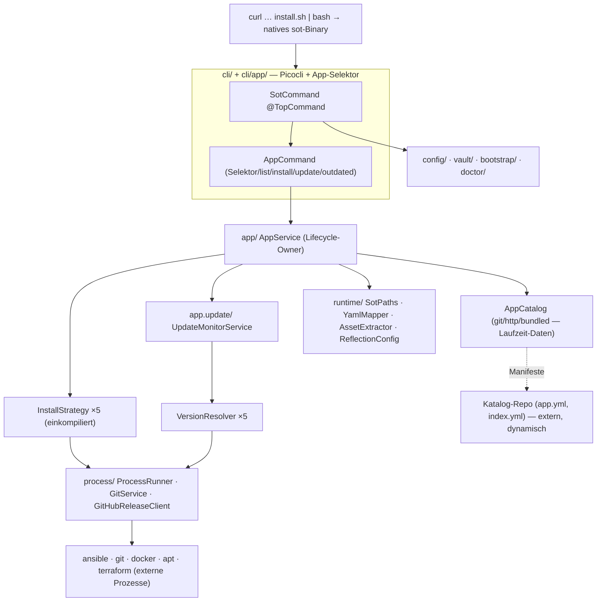

# SOT — Rewrite-Plan: Bash → natives Java-CLI (Quarkus + GraalVM), als dynamischer App-Manager

> **Was gebaut wird:** SOT wird komplett von Bash auf ein **natives Java-CLI** umgebaut — **Java 21 · Quarkus 3.37+ · Picocli · GraalVM/Mandrel native-image**, ein selbstständiges Binary pro Plattform, **gebaut mit Gradle**, mit einem **Justfile** als Entwickler-Frontend.
>
> **Wozu:** SOT ist ein **dynamischer App-Manager für die eigene Umgebung** — ein CLI-**App-Selektor**, mit dem der Owner seine **eigenen Anwendungen** installiert, aktualisiert und **überwacht** (welche App ist veraltet), plattform-/quellenübergreifend, **ohne den Toolneubau** (neue App = neue Manifest-Datei im Katalog).
>
> **Grundlagen-Doku (Evidenz):** [`refactoring-findings.md`](./refactoring-findings.md) (88 Ist-Befunde = funktionale Spec), [`java-quarkus-design-brief.md`](./java-quarkus-design-brief.md) (Schicht-Entwurf), [`java-quarkus-appmanager-brief.md`](./java-quarkus-appmanager-brief.md) (App-Manager + Delivery). Der alte Bash-in-place-Plan [`refactoring-plan.md`](./refactoring-plan.md) ist **superseded**.

---

## 1. Die zwei Kern-Anforderungen (und wie der Plan sie erfüllt)

| # | Anforderung | Umsetzung |
|---|---|---|
| **A** | **Ein-Befehl-Installation via GitHub-URL** auf Debian/Linux — Nutzer geben genau **einen** Bash-Befehl ein. | `curl -fsSL https://raw.githubusercontent.com/NiklasJavier/SOT/<ref>/install.sh \| bash` lädt das passende **vorgebaute native Binary** aus GitHub Releases, verifiziert (SHA-256 + cosign) und legt `sot` auf den PATH. Kein JVM, kein Build beim Nutzer. → §3 |
| **B** | **Dynamischer App-Manager**: App-Selektor im CLI, eigene Anwendungen installieren/updaten **über alle Apps hinweg**, mit **Update-Überwachung**, „tief dynamisch". | Apps sind **deklarative Manifeste** (`app.yml`) aus einem **konfigurierbaren Katalog-Repo**, orchestriert von einem festen Satz **Install-Strategien**. Neue App = Manifest hinzufügen, **kein Rebuild**. Ein `UpdateMonitor` prüft quellenübergreifend „veraltet?". → §2 |

**Der architektonische Kniff (löst „tief dynamisch" vs. GraalVM-Closed-World):** GraalVM native-image ist **Closed-World** — kein Laden neuer Java-Klassen zur Laufzeit. „Tief dynamisch" heißt daher **nicht** „Java-Plugins nachladen", sondern: die **Menge der Strategien** (git/docker-compose/release-binary/deb/script) ist fest **einkompiliert**; **welche Apps existieren** und ihre gesamte Konfiguration sind **100 % Laufzeit-Daten** (Manifeste aus git/HTTP). So ist das System voll dynamisch **ohne** die Closed-World-Annahme zu verletzen.

---

## 2. Kern-Zweck: Der dynamische App-Manager

### 2.1 Zwei getrennte Achsen (das zentrale Designprinzip)

Bash vermischte „**woher** kommt eine App-Definition" mit „**wie** wird sie installiert". Java trennt sie:

- **`CatalogSource` — WOHER (100 % Laufzeit-Daten).** Ein konfigurierbarer Satz Kataloge: `git` (dein Katalog-Repo), `http-index` (ein Index-URL), `bundled` (eingebettete Default-Apps). Zur Laufzeit gefetcht, nach `priority` gemerged. Neue App = `app.yml` in den Katalog legen.
- **`InstallStrategy` — WIE (fest einkompiliert).** Fünf CDI-Beans hinter **einem** Interface: `git-repo`, `docker-compose`, `github-release-binary`, `apt-deb`, `script`. Neue Strategie = Bean hinzufügen (Rebuild). Jede delegiert an die geteilte `ProcessRunner`/`GitService`/`GitHubReleaseClient` — kein Neuimplementieren von exec.

Das **subsumiert die alte Extension/Plugin-Schicht**: eine „Extension" (AAT/TID) ist jetzt einfach eine App mit einem `runner:`-Block. `CapabilityService`→`AppService`, `CapabilityStateStore`→`InstalledAppStore`, `module.yml`→`app.yml`. Ein Vokabular.

### 2.2 Das App-Manifest (`app.yml`) — die deklarative Einheit

```yaml
apiVersion: sot.dev/v1
kind: App
id: grafana                     # katalog-eindeutige, stabile ID
name: Grafana
description: Monitoring dashboards
category: observability
labels: [monitoring, ui]
source:                         # WIE installieren → wählt die InstallStrategy
  type: docker-compose          # git-repo | docker-compose | github-release-binary | apt-deb | script
  repoUrl: https://github.com/owner/grafana-stack
  ref: v10.4.0
  composeFile: docker-compose.yml
version:                        # WIE „neueste Version" bestimmen → wählt den VersionResolver
  strategy: docker-image        # github-release | git-tag | docker-image | apt | static | script
  constraint: '>=10.0.0 <11.0.0'
  tagPattern: '^v(\d+\.\d+\.\d+)$'
requires:                       # topologisch vor der Installation aufgelöst
  tools: [docker]
  apps:  [prometheus]
  os:    [debian, ubuntu]
install:
  path: '{appsRoot}/grafana'    # via SotPaths getemplatet
  env:  { GF_PORT: '3000' }
  hooks: { postInstall: scripts/post.sh }
runner:                         # OPTIONAL — vorhanden ⇒ App ist eine AAT/TID-artige Ansible-Extension
  playbooks: [site.yml]
```

Ein Katalog listet seine Apps in einer `index.yml` (`id → manifest-Pfad + denormalisierte Version` für schnelles Listing). Der installierte Zustand lebt getrennt in `installed.yml` (0600, atomar geschrieben): installierte Version, Quelle, Pfad, Pin-Status, Checksum.

### 2.3 Die eine Install-Strategie-Schnittstelle

```java
public interface InstallStrategy {
  AppSourceType type();                                      // GIT_REPO | DOCKER_COMPOSE | GITHUB_RELEASE_BINARY | APT_DEB | SCRIPT
  ResolvedSource resolve(AppManifest m, InstallContext ctx); // bindet+validiert source.options (raw JsonNode → typisierte Slice)
  InstallOutcome install(ResolvedSource s, InstallContext ctx);
  InstallOutcome update (ResolvedSource s, InstalledApp cur, InstallContext ctx);
  void           remove (InstalledApp cur, InstallContext ctx);
}
// Verdrahtung: @All List<InstallStrategy> → Map<AppSourceType,InstallStrategy> zur BUILD-Zeit (Closed-World)
```

`AppService` ist der einzige Lifecycle-Owner: `list/search/info/install(topo-resolve requires.apps)/update/upgradeAll/remove/pin/unpin/outdated`. Er wählt die Strategie aus der `Map<AppSourceType,…>` und persistiert über `InstalledAppStore`.

### 2.4 Update-Überwachung (das „überwacht, ob geupdated werden kann")

Getrennte Achse `de.jklein.sot.app.update`: ein **`VersionResolver`-SPI** je Quelltyp (`UpdateStrategy` = `GITHUB_RELEASE | GIT_TAG | DOCKER_IMAGE | APT | STATIC | SCRIPT`), ebenfalls `@All`-injiziert. `InstallStrategy.update()` **ruft** den passenden `VersionResolver` — kein doppeltes „latest"-Design.

```java
interface VersionResolver { UpdateStrategy strategy(); ResolvedVersion resolveLatest(VersionQuery q, ResolverContext ctx); }
record ResolvedVersion(Optional<Version> latest, String rawLatest, Optional<String> digest, Instant at, CacheDisposition cache) {}
enum UpdateStatus { UP_TO_DATE, UPDATE_AVAILABLE, PINNED, UNKNOWN, NOT_INSTALLED }
record OutdatedReport(Instant generatedAt, List<AppUpdateReport> apps, int upToDate, int updatable, int pinned, int unknown) {}
```

- **`UpdateMonitorService.checkAll()`** fächert `resolveLatest()` über **Virtual Threads** (StructuredTaskScope + Semaphore) über **alle installierten Apps**, vergleicht eine **hand-gerollte, native-sichere `SemVer`** gegen die installierte Version unter Berücksichtigung von `constraint` + Pin, und faltet in einen `OutdatedReport`. Fehler je App → `UNKNOWN`, nie Abbruch.
- **Kein Daemon.** Das Binary ist kurzlebig (schneller Start ist der Punkt). `sot bootstrap` installiert einen **systemd-Timer** (Cron-Fallback), der `sot app check --quiet --notify` tickt; der Tick schreibt `last-check.json`, `UpdateNotifier` meldet nur bei **Zustandsänderung**. `sot app status`/`outdated` lesen den Cache für sofortige Offline-Anzeige (Netz nur bei `--refresh`).
- **Robust gegen die Realität:** ETag-Conditional-GETs + TTL-Cache + Serve-Stale bei Rate-Limit; nicht-semver-Tags (calver/sha/`:latest`) werden per **Gleichheit/Digest** verglichen (keine erfundene Ordnung); Pins (`installed.yml`, nicht Manifest): EXACT→eingefroren, RANGE→Update nur innerhalb der Range.

### 2.5 Der App-Selektor (die Bedien-Oberfläche)

Ein Picocli-Parent `sot app` (Aliase `apps`, `a`) — **die eine Vokabel** für das, was früher extensions/plugins/capabilities war. Bare auf einem TTY startet der interaktive Selektor; bare in einer Pipe druckt `list` (blockiert nie).

```
sot app                      # TTY → interaktiver Selektor · Pipe → list
sot app browse | select      # Selektor explizit (für Skripte/Tests)
sot app list [--json] [--outdated] [--role runner]      (alias ls)
sot app search <query>       # fuzzy über alle Kataloge
sot app info <id> [--json]   # Manifest, Quelle, installiert/verfügbar, Dep-Baum
sot app install <id>[@version]… [--yes] [--dry-run]     (alias add, i)
sot app update <id> | --all [--yes]                     (alias up)   # überspringt Pins
sot app outdated [--json] [--cached]                    (alias stale) # ← Monitoring-Fläche
sot app status [<id>]        # Dashboard: up-to-date/outdated/pinned/unknown/broken
sot app check [--quiet] [--notify] [--refresh]          # Timer-/Refresh-Einstieg
sot app remove <id> [--yes]                             (alias rm, uninstall)
sot app pin <id>[@version|range] | sot app unpin <id>
sot app catalog list | add <url> | remove <id> | refresh   (alias: sot app refresh)
sot ex …                     # lebendiger Alias: Filter role=runner (AAT/TID-Muscle-Memory)
sot extensions… | sot plugins…   # deprecated Forwarder → app list/install (mit Hinweis)
```

Der `AppSelector` ist bewusst **zeilenorientiert** (nummerierte Tabelle via `ConsoleService` + `BufferedReader`-Loop: Zahlen togglen, `/query` fuzzy, `a` alle, `i` install, `u` update, Enter bestätigen, `q` quit). **Kein JLine/ncurses/`stty`** → trivial GraalVM-native-sicher; bei `System.console()==null` verweigert er und fällt auf `list`. Globale Automations-Flags (`--json`, `--yes`, `--no-color`, `--catalog`, `--dry-run`) via `scope=INHERIT`.

---

## 3. Installation: der eine Befehl (Anforderung A)

Zwei Ebenen — **Ebene 1** ist der geforderte Ein-Zeiler, **Ebene 2** hält aktuell:

```bash
# System-weit (→ /usr/local/bin/sot)
curl -fsSL https://raw.githubusercontent.com/NiklasJavier/SOT/<ref>/install.sh | sudo bash
# Per-User (→ ~/.local/bin/sot)
curl -fsSL https://raw.githubusercontent.com/NiklasJavier/SOT/<ref>/install.sh | bash
# Version pinnen (umgeht die GitHub-API, deterministisch)
SOT_VERSION=v1.2.0 curl -fsSL …/install.sh | bash
```

**`install.sh`** (die **einzige** verbleibende Shell, `set -euo pipefail`, shellcheck-gegated):

```bash
REPO=NiklasJavier/SOT
os=$(uname -s | tr A-Z a-z)                          # linux|darwin
arch=$(uname -m); case $arch in x86_64) arch=amd64;; aarch64|arm64) arch=arm64;; esac
tag=${SOT_VERSION:-$(curl -fsSL https://api.github.com/repos/$REPO/releases/latest | grep -m1 tag_name | cut -d'"' -f4)}
base=https://github.com/$REPO/releases/download/$tag ; asset=sot-$os-$arch
curl -fsSL -o "$tmp/$asset" "$base/$asset" ; curl -fsSL -o "$tmp/$asset.sha256" "$base/$asset.sha256"
( cd "$tmp" && sha256sum -c "$asset.sha256" )        # Pflicht
command -v cosign >/dev/null && cosign verify-blob --certificate "$asset.pem" --signature "$asset.sig" \
  --certificate-identity-regexp 'https://github.com/NiklasJavier/SOT/.+' \
  --certificate-oidc-issuer https://token.actions.githubusercontent.com "$tmp/$asset"   # best-effort
if [ -w /usr/local/bin ] || command -v sudo >/dev/null; then dest=/usr/local/bin; else dest=$HOME/.local/bin; mkdir -p "$dest"; fi
${SUDO} install -m755 "$tmp/$asset" "$dest/sot"      # dann: Hinweis „sot bootstrap" / PATH
```

- **Debian-spezifisch:** installiert **nur** das `sot`-Binary (setzt `curl`/`ca-certificates` voraus). Laufzeit-Tools (git/ansible/docker) werden **nicht** still per apt gezogen — `sot doctor`/`sot bootstrap` erkennen/melden sie (D19).
- **Fallbacks:** `/usr/local/bin` nicht schreibbar → `~/.local/bin` + PATH-Hinweis; darwin → „build-from-source/JVM"-Meldung statt 404 (v1 shippt linux amd64/arm64).
- **Ebene 2 — `sot self-update`:** in-Binary, nutzt denselben Asset-/Verify-Kontrakt (GitHub-Release → SHA-256 + cosign → Sibling-Temp → `ATOMIC_MOVE` → re-exec).
- **Asset-Namens-Kontrakt** (single-sourced zwischen JReleaser und `install.sh`): `sot-<os>-<arch>` + `.sha256` + `.sig` + `.pem`, plus `checksums_sha256.txt`, `sbom.syft.json`.

---

## 4. Ziel-Stack

| Ebene | Wahl | Warum |
|---|---|---|
| Sprache | **Java 21** (LTS) | Records, sealed types, **virtual threads** (Update-Fan-out), Pattern Matching |
| Framework | **Quarkus 3.37+** | Für GraalVM native gebaut; Build-Time-DI (Arc) → passt zur Closed-World |
| CLI | **quarkus-picocli** | Command-Baum, CDI-Injektion, `AutoComplete.GenerateCompletion` (bash/zsh aus dem Spec) |
| Config/Manifest | **quarkus-jackson + jackson-dataformat-yaml** | Ein Parser; typisierte Records; `#`/Quote/Backslash-Korruption unmöglich |
| Validierung | **quarkus-hibernate-validator** | Bean-Validation auf Config-/Manifest-Records |
| Templating | **quarkus-qute** (`@CheckedTemplate`) | Typsicheres Vault-Template, reflection-frei |
| Native | **Mandrel/GraalVM CE 21** | `-H:+StaticExecutableWithDynamicLibC` (**mostly-static glibc**, nicht musl — s. §7/D1); `resources.includes` bettet Assets ein |
| **Build** | **Gradle (Groovy DSL)** | *(vom Owner gewählt statt Maven)* Quarkus-Gradle-Plugin; `./gradlew build -Dquarkus.native.enabled=true` |
| **Dev-Frontend** | **Justfile** (`just`) | *(vom Owner gewählt)* wrappt die Default-Befehle für optimale Ersteinrichtung |
| Release | **JReleaser (Gradle-Plugin)** + GitHub Actions | Per-Plattform-Binaries, Checksums, SBOM (Syft), cosign auf GitHub Releases |

**Scaffolding & Build (verifiziert gegen aktuelle Quarkus-Docs):**
```bash
quarkus create cli de.jklein.sot:sot --gradle -x picocli          # Gradle-Projekt (Groovy DSL)
./gradlew addExtension --extensions='quarkus-jackson,quarkus-hibernate-validator,quarkus-qute'
./gradlew quarkusDev                                              # Live-Reload
./gradlew build                                                   # JVM-Jar + Tests
./gradlew build -Dquarkus.native.enabled=true                    # natives Binary
./gradlew check                                                   # Tests + Int-Tests + JaCoCo (CI-Gate)
./gradlew jreleaserFullRelease                                   # Release (Binaries/Checksums/SBOM/cosign)
```

Native-Flags gehören in `application.properties` (nicht `build.gradle`):
```properties
quarkus.native.builder-image=quay.io/quarkus/ubi9-quarkus-mandrel-builder-image:jdk-21
quarkus.native.container-build=true
quarkus.native.additional-build-args=-H:+StaticExecutableWithDynamicLibC   # mostly-static glibc (fork/exec-sicher), NICHT --libc=musl
quarkus.native.resources.includes=apps/**,ansible/**,docker/**,templates/**,config/**,assets/manifest.txt
quarkus.native.add-all-charsets=true
```

**Justfile** (Entwickler-Entrypoint, wrappt `./gradlew`):
```
setup · dev · build · native · test · lint · fmt · run *ARGS · install-local · release TAG · clean
apps → sot app list · install <id> → sot app install <id> · check → sot app check --refresh · install-timer
```

---

## 5. Ziel-Architektur

### Package-Baum (`de.jklein.sot.*`)

```
de.jklein.sot/
├── cli/         Picocli-Baum: SotCommand(@TopCommand)·Main(@QuarkusMain)·{Bootstrap,Doctor,Vault,Runner,Update,Delete,Interactive}Command
│               · SotVersionProvider · AliasExpander · ConsoleService/ProgressReporter · SotExitCode
│   └── app/     App-Selektor-UX: AppCommand(app|apps|a) · AppSelector(zeilenorientiert) · AppTableRenderer · SelectionState
│               · App{Select,List,Search,Info,Install,Update,Outdated,Status,Remove,Pin,Unpin,Refresh}Command · AppNameCandidates
│               · ExtensionsCommand/PluginsCommand (deprecated Forwarder)
├── app/         ★ KERN: AppManifest · SourceSpec · AppSourceType(enum) · InstallStrategy(interface)
│               · {GitRepo,DockerCompose,GithubReleaseBinary,AptDeb,Script}Strategy · AppCatalog · CatalogSource · CatalogIndex
│               · InstalledAppStore · InstalledApp · AppService · AppStatus · SemVer · RunnerSpec
│   └── update/  UpdateMonitorService · VersionResolver(interface) · {GitHubRelease,GitTag,DockerImage,AptPolicy,Script}Resolver
│               · Version/VersionConstraint · VersionCache · AppUpdateReport/OutdatedReport · UpdateScheduler/UpdateNotifier · InstalledApps(port)
├── config/      SotConfig + Sektions-Records (System/Ssh/Logging/Paths/Tools/Ansible/Runner/Vault) · CatalogSource-Liste
│               · YamlConfigCodec · ConfigMerger · PlaceholderResolver · ConfigValidator · SecretStore · ConfigService
├── vault/       Secret(AutoCloseable) · VaultPasswordSource(sealed) · SecretResolver · TransientPasswordFile · PosixGuards
│               · AnsibleVaultRunner · SecretGenerator · VaultTemplateRenderer · VaultSecrets · VaultService
├── process/     ProcessRunner(interface)+Impl · ProcessSpec/Result · ProgressSink/TeeSink · SecretMaterializer
│               · GitService/GitSyncSpec · GitHubReleaseClient · ChecksumVerifier · WorkspaceManager · ToolPreflight
├── runner/      AnsiblePlaybookInvocation · AnsibleVaultInvocation · TerraformInvocation · DockerInvocation
├── bootstrap/   BootstrapTask(interface)+Task-Beans · TaskRunner · TaskResult/BootstrapReport · InstallLayout
│               · DependencyInstaller · SelfUpdateCommand · BinaryUpdater · BuildInfo
├── doctor/      DoctorService
└── runtime/     YamlMapperProducer · SotPaths · AssetExtractor · ReflectionConfig

src/main/resources/   application.properties · config/default_config.yml · templates/vault/secrets.yml (Qute)
                      · apps/**/app.yml (gebündelte Default-Apps) · ansible/** · docker/** · assets/manifest.txt (build-generiert)
repo-root/            build.gradle · settings.gradle · gradle.properties · gradlew · Justfile · install.sh
                      · jreleaser (Gradle-Plugin) · .pre-commit-config.yaml · .github/workflows/{ci,native-build,release}.yml
```

### Schichten-Diagramm



### Sieben Prinzipien
1. **Zwei Achsen getrennt:** Kataloge (Daten, dynamisch) vs. Strategien (Beans, einkompiliert) → tief dynamisch trotz Closed-World.
2. **Ein Dispatch-Pfad** (`CommandLine.execute`), ein Vokabular (`sot app`), tote Aliase nicht kompilierbar.
3. **State per Konstruktor-Injektion**, nie positional argv (R3 aufgelöst).
4. **Ein YAML-Parser, ein Schema** — Config & Manifeste durch denselben typisierten `YAMLMapper`.
5. **Secrets sind ein Typ** (`Secret`), nie auf argv/Config/Log.
6. **Ein Install-Root, ein Binary** — alle Pfade aus `SotPaths`; der ausgeführte CLI ist der installierte.
7. **Build-Time-Wahrheit** — Command-Baum, Strategien, Resolver, Tasks zur Build-Zeit aufgelöst (`@All`).

---

## 6. Capability-Mapping: Bash → Java

**Legende:** **[S]** = löst sich *strukturell* auf · **[C]** = *bewusst zu härten* · **[L]** = *manuell in den Ansible-Assets zu fixen*.

| Bash | Java-Ersatz | Grundursache |
|---|---|---|
| `bin/sot`-Dispatch, `CLI_METADATA_ARGS` | `cli.Main` + `SotCommand`-Baum + Konstruktor-Injektion | R3, A — [S] |
| `lib/cli/{registry,aliases,progress}.sh`, `colors.sh` + 6 ANSI-Kopien, `completions/*` | `cli/` (Command-Baum, `ConsoleService`, `AutoComplete.GenerateCompletion`) | A/E/I/R6/R7 — [S] |
| `lib/core/yaml_parser.sh` + 3 weitere Parser, `default_config{,_v2}.yml` | `YamlConfigCodec` + `YamlMapperProducer` + `SotConfig`-Records | R1/D/G/H — [S] |
| `lib/plugins/manager.sh` + `lib/extensions/manager.sh` + `commands/extensions.sh` (3 Manager, 4 Begriffe) | **`app/` App-Manager** (`AppService`+`AppCatalog`+`InstallStrategy`) — Extension = App mit `runner:` | R2/B — [S] |
| `modules/*/module.yml`, `parse_plugin_yaml`, `PLUGIN_DEPENDENCIES` | `AppManifest` + `ManifestParser` + topologische `requires.apps` | B — [S] |
| `_update_config_value`/`save_plugin_state` (persistiert nie) | `InstalledAppStore` (typisiert, atomar) | B/F — [S] |
| *(neu — Anforderung B)* Update-Überwachung | **`app.update/` `UpdateMonitorService` + `VersionResolver`-SPI** + systemd-Timer | neue Fähigkeit — [C] |
| `commands/runner.sh`, `trigger.sh` | `process.ProcessRunner` + `runner.*Invocation` | R3/R6 — [S] |
| Git-Sync (4×), `update.sh` `reset --hard` | `GitService.gitSync(PULL/RESET_HARD, --force-gated)` | R6/G — [S]; Datenverlust — [C] |
| `commands/vault.sh`, Vault-Rollen, `vault_template.j2` | `vault.VaultService` + `Secret` + `TransientPasswordFile` + Qute | R5/H — [S]; tmpfs/Race — [C] |
| `bootstrap/init.sh` curl\|bash Selbst-Clone | **`install.sh` (dünn) + Prebuilt-Binary** + `InstallLayout` | R4/C, A — [S]; Root-Wahl — [C] |
| `bootstrap/{tasks,runner,args_parser,dependencies}.sh` | `BootstrapTask`-Beans + `TaskRunner` + `DependencyInstaller` | F — [S] |
| `commands/maintenance/{update,delete}.sh` | `SelfUpdateCommand`/`BinaryUpdater` + `SafeFsRemover` | G/H — [S]; Cross-Device/TLS — [C] |
| **`modules/ansible/roles/*` INHALT** (UFW `allow`, Rollenname, hosts-Regex, Vault-Lifecycle, OS) | **portierte, gefixte Ansible-Assets** (bleiben YAML) | **Thema L (10) — manuell [L]** ⚠️ |
| `tests/*.sh` + Mock-vault | `@QuarkusTest`/`@QuarkusMainTest`/native-IT + `RecordingProcessRunner` | K — [S] |
| `.github/workflows/*`, `.pre-commit` | `ci/native-build/release`.yml (Gradle) + JReleaser | R7/I — [S]; native musl/exec — [C] |

**Bilanz:** Der Großteil der 88 Befunde löst sich **strukturell [S]** auf; ~8–10 brauchen **Härtung [C]** (native Reflection/Ressourcen, Linking, Secrets, Legacy-Migration, Self-Replace, **Supply-Chain der Kataloge**, Update-Fan-out); **10 (Thema L)** sind manuell in den portierten Ansible-Assets zu fixen (Phase 7).

---

## 7. Native-Image-Constraints

| Bereich | Was zu tun ist |
|---|---|
| **Closed-World-Dynamik (Kernmuster)** | Strategie-/Resolver-**Menge** einkompiliert via `@All List<InstallStrategy>`/`@All List<VersionResolver>` → `Map<enum,bean>` zur Build-Zeit; **welche Apps** existieren = reine Laufzeit-Daten (git/http-Manifeste). Kein `Class.forName`, kein Runtime-Classloading. |
| **Reflection** | `@RegisterForReflection` zentral in `ReflectionConfig` für **alle** Jackson-Records: `AppManifest`, `SourceSpec`, `VersionSpec`, `Requires`, `InstallSpec`, `RunnerSpec`, `CatalogIndex`, `InstalledApp`, **jede Strategie-Option-Slice**, GitHub-/Docker-Registry-DTOs, Report-Records, `AppNameCandidates`, Picocli-Provider. Sonst binden sie **null**. |
| **Polymorphie** | `SourceSpec` generisch (`AppSourceType` + roher `JsonNode`), per-Strategie-Binding in `resolve()` — **kein** Jackson `@JsonSubTypes` (bläht die Reflection-Fläche). |
| **Ressourcen** | Gebündelte Apps unter `src/main/resources/apps/**/app.yml`; `resources.includes` + `AssetExtractor` iteriert das **build-generierte** `assets/manifest.txt` (native kann Classpath nicht `Files.walk`en). |
| **TLS** | `quarkus.ssl.native=true` + eingebetteter CA-Truststore (api.github.com, ghcr.io, registry-1.docker.io, Debian-Mirror) — geteilt mit Self-Update. |
| **Prozess-Exec + Linking ⚠️** | **musl-static kann nicht fork/exec** — und jede Install/Update/Version-Prüfung ruft externe Tools. Daher **mostly-static glibc** (`-H:+StaticExecutableWithDynamicLibC`). CI muss echten Subprozess-Aufruf aus dem Binary beweisen. |
| **Kein Daemon** | Scheduling via externe systemd/cron-Unit (von bootstrap materialisiert); Binary läuft je Tick einmal. |
| **Kein JLine/ncurses** | Selektor = ANSI-Writes + Zeilen-Reads; `System.console()==null` → verweigern. `Clock` injizieren (deterministisch). |

---

## 8. Offene Entscheidungen

Der Multi-Agenten-Entwurf hat Widersprüche zwischen Schichten aufgedeckt; hier **aufgelöst** (⚠️ = load-bearing, bitte bestätigen).

| # | Entscheidung | Festlegung |
|---|---|---|
| **D1** ⚠️ | Native-Linking | **mostly-static glibc** — Korrektheits-Constraint (fork/exec); CI beweist Subprozess-Exec vor Release |
| **D2** | Root-Package | `de.jklein.sot` |
| **D3** ⚠️ | Install-Root + Symlink | Root **`/opt/sot`**, Symlink `/usr/local/bin/sot`; `SotPaths`/`InstallLayout` zu **einem** Modell mergen — **bitte bestätigen** |
| **D4** | Extension/Plugin-Schicht | **Kollabiert in den App-Manager** — Extension = App mit `runner:`; alte Namen nur als Aliase |
| **D5** | „latest version" — zwei Designs | **`InstallStrategy` (install/update/remove) delegiert an `VersionResolver` (latest)** — orthogonale Achsen (`source.type` ≠ `version.strategy`), kein Doppel-Design |
| **D6** | Strategie-Vokabular | `AppSourceType{GIT_REPO,DOCKER_COMPOSE,GITHUB_RELEASE_BINARY,APT_DEB,SCRIPT}` (install) ⟂ `UpdateStrategy{GITHUB_RELEASE,GIT_TAG,DOCKER_IMAGE,APT,STATIC,SCRIPT}` (version) |
| **D7** | `AppService`-Kontrakt | **Ein** Interface (Domänen-Form + Read-Views `catalog()/installed()/outdated()`) |
| **D8** | Katalog-Refresh-Name | Kanonisch `sot app catalog refresh` (`sot app refresh`/`sync` als Alias) |
| **D9** | Semver | Hand-gerollt native-sicher (`Version`/`VersionConstraint`); `org.semver4j` als Fallback |
| **D10** | Scheduling | systemd-Timer (Cron-Fallback) → `sot app check --quiet --notify`; kein In-Process-Daemon |
| **D11** ⚠️ | **Katalog-Trust (Supply-Chain)** | `CatalogSource.trust` (gepinnter git-ref / cosign+sha256 für http-index); **`script`-Strategie erfordert interaktive Bestätigung**, außer signiert+trusted; dein eigener Katalog ist die einzige Default-Trusted-Quelle — **bitte bestätigen** |
| **D12** | Rate-Limits/Auth | ETag-Conditional-GETs + TTL-Cache + Serve-Stale; optionaler PAT; Docker-Bearer-Flow |
| **D13** | Selektor-UI | Zeilenorientiert (kein JLine) |
| **D14** | Build-DSL | Groovy (Quarkus-Default) |
| **D15** | JReleaser | Gradle-Plugin (`jreleaserFullRelease`) |
| **D16** | `install.sh` apt-installs? | **Nein** — nur das `sot`-Binary; Tools via `doctor`/`bootstrap` |
| **D17** | Version-Pin im Ein-Zeiler | Default `releases/latest`; `SOT_VERSION`/Positional pinnt |
| **D18** | cosign | Keyless (Fulcio/Rekor, GitHub-OIDC); sha256 Pflicht, cosign best-effort |
| **D19** ⚠️ | macOS-Scope | v1 **Linux nativ** (amd64/arm64); macOS nur JVM/Dev — **bitte bestätigen** |
| **D20** | Legacy-Migration | Einmal-Reader (`FAIL_ON_UNKNOWN=false` + Key-Mapping); `module.yml`→`app.yml` (Docker-Templates in je eigene compose-Apps) — nötig nur bei **Feld-Installationen** — **bitte bestätigen** |

---

## 9. Migrations-Phasen (Greenfield, „Strangler" bis Parität)

Neubau in einem Gradle-Modul, Fähigkeit für Fähigkeit, jede Phase eine PR mit **Abnahme-Gate**. Aufwand: **S** ≤ 2 T, **M** ≈ 3–5 T, **L** ≈ 1–2 Wo.

- **Phase 0 — Skelett & Foundation** *(L · fixiert D1–D4)* — Gradle/Quarkus/Java-21, `Justfile`, `quarkus-picocli`-`sot version`, `YamlMapperProducer`/`SotPaths`/`AssetExtractor`/`ReflectionConfig`, `ci.yml` mit **JVM-Verify + linux-amd64-Native-Smoke, der einen echten Subprozess startet** (verifiziert D1). **Gate:** `sot version` nativ + Native-Binary ruft `git --version`.
- **Phase 1 — Config-Kern** *(L · löst R1/D)* — `SotConfig`-Records, `YamlConfigCodec`, Merge/Placeholder/Validator, `SecretStore`, `CatalogSource`-Liste in der Config. **Gate:** Config-Roundtrip + native-IT bindet `default_config.yml`.
- **Phase 2 — Prozess-/Exec-Engine** *(M · löst R6)* — `ProcessRunner`+Impl, `GitService`, `GitHubReleaseClient`, `ChecksumVerifier`, `SecretMaterializer`, `WorkspaceManager`, `ToolPreflight`. **Gate:** Native-Smoke ruft echtes `git`.
- **Phase 3 — CLI-Gerüst** *(M · löst A/F-Dispatch)* — `SotCommand`-Baum, `Main`, Hilfe/Version/Completion, Aliase, Exit-Codes, `ConsoleService`. **Gate:** `@QuarkusMainTest` e2e.
- **Phase 4 — ★ App-Manager Kern** *(L · Anforderung B, löst R2/B)* — `AppManifest`+`ManifestParser`, `AppCatalog` (git/http/bundled), 5 `InstallStrategy`-Beans, `AppService`, `InstalledAppStore`, `SafeFsRemover`, `requires`-Topo-Sort. **Gate:** install/update/remove/**persist** je Strategie über einen Test-Katalog; kaputtes Manifest failt bei Discovery.
- **Phase 5 — ★ Update-Überwachung** *(L · Anforderung B)* — `VersionResolver`-SPI (5), `UpdateMonitorService` (Virtual-Thread-Fan-out), `VersionCache` (ETag/TTL/Serve-Stale), `SemVer`/`VersionConstraint`, Pins, `UpdateScheduler`/`UpdateNotifier`. **Gate:** `outdated` über Mock-Resolver korrekt (up-to-date/outdated/pinned/unknown); Cache-Roundtrip.
- **Phase 6 — ★ App-Selektor & Command-Surface** *(M · Anforderung B)* — `AppCommand`-Baum, `AppSelector` (zeilenorientiert), Renderer, alle Subcommands, `--json`/`--yes`, `AppNameCandidates`-Completion, `ex`/deprecated Forwarder. **Gate:** `@QuarkusMainTest` über list/install/outdated/selector; non-TTY→list.
- **Phase 7 — Vault, Bootstrap, Runner & Ansible-Assets** *(L · löst R5/C/F + Thema L)* — `VaultService`+`Secret`+tmpfs, `BootstrapTask`-Pipeline, `DependencyInstaller`, `RunnerCommand`, systemd-Timer-Materialisierung; **Ansible-Assets fixen** (UFW `deny`, Rollenname, hosts-Regex, Vault-Lifecycle, OS-Abstraktion). **Gate:** `sot bootstrap` gegen Wegwerf-Container; `ansible-lint`; Vault-Roundtrip.
- **Phase 8 — Install-Einzeiler, Packaging & Release** *(L · Anforderung A, löst R7)* — `install.sh` (uname/download/verify/PATH), `SelfUpdateCommand`+`BinaryUpdater`, JReleaser-Gradle-Multi-Arch, `native-build.yml`/`release.yml`, `.pre-commit`. **Gate:** Getaggter Release → verifizierte Binaries; **der Ein-Zeiler installiert `sot` in einem frischen Debian-Container**; `sot self-update`-Roundtrip.
- **Phase 9 — Parität, Cutover & Legacy-Migration** *(M · final)* — volle Coverage, Legacy-`config.yaml`/`module.yml`→`app.yml`-Migrations-Reader, **88-Befund-Regressions-Checkliste** (jedes [S] weg, [C] mitigiert, [L] gefixt), Bash entfernen, README neu. **Gate:** Checkliste 100 %; `mvn`/`pom.xml`/`--libc=musl`-grep leer.

### Sequenz
```
0 (Skelett, D1) → 1 (Config) & 2 (Exec)
                     └→ 3 (CLI) → 4 (App-Kern) → 5 (Update-Monitor) → 6 (Selektor)
                     └→ 7 (Vault/Bootstrap/Ansible)   [parallel ab 2]
8 (Install/Release)  [ab 0 vorbereitbar, voll ab lauffähiger App]
9 (Parität/Cutover)  [zuletzt]
```
**Kritischer Pfad:** 0 → 1/2 → 3 → 4 → 5 → 6 → 8 → 9. Der App-Manager (4–6) ist der Wertkern und der größte Brocken.

---

## 10. Verifikationsstrategie

- **Drei Test-Tiers:** `@QuarkusTest` (JVM, gemockter `ProcessRunner`/`VersionResolver`) · `@QuarkusMainTest` (CLI-e2e) · `@QuarkusMainIntegrationTest` (**native** Black-Box, `FakeToolPathResource`).
- **Native-Gate Pflicht:** ein natives IT lädt Config, parst je ein Manifest **jedes** `source.type`, startet einen echten Subprozess (`git --version`) — verwandelt Reflection-/Linking-Fehler in gefangene CI-Fehler.
- **Release-Smoke:** der publizierte Ein-Zeiler wird in einem **frischen Debian-Container** gegen den echten Release ausgeführt (Anforderung A).
- **Paritäts-Checkliste** gegen `refactoring-findings.md`: jeder der 88 Befunde bekommt Status [S]/[C]/[L] mit Nachweis — Abnahme für Phase 9.
- **Supply-Chain-Test:** ein unsigniertes Katalog-Manifest mit `script`-Strategie muss ohne Bestätigung **abgelehnt** werden.
- **CI failt hart** (kein `|| true`).

---

## 11. Risiken & Gegenmaßnahmen (Top 8)

| # | Risiko | Gegenmaßnahme |
|---|---|---|
| 1 ⚠️ | **musl-static kann nicht fork/exec** | mostly-static glibc; CI beweist Subprozess-Exec vor Release (D1) |
| 2 ⚠️ | **Supply-Chain / RCE** — Katalog-Manifest mit `script`/deb-Strategie führt Fremdcode aus; `curl\|bash` ist MITM-Fläche | Kataloge signieren/pinnen (git-ref bzw. cosign+sha256); `script` nur mit Bestätigung außer trusted; `install.sh` sha256 **Pflicht** + cosign keyless, nur https (D11/D18) |
| 3 | Native-Reflection-Miss → stilles null-Binden → Fehl-Installation | zentrale `ReflectionConfig`; native-IT bindet je `source.type` ein Manifest voll |
| 4 | `outdated`-Fan-out langsam / rate-limited (60 GitHub-Calls/h unauth) | Virtual-Threads + ETag-Conditional-GETs (304 gratis) + TTL-Cache + Serve-Stale + optionaler PAT + denormalisierte Version im Index |
| 5 | Versions-Heterogenität (calver/sha/`:latest`) → falsche Ordnung | Gleichheit/Digest statt erfundener Ordnung; optionaler `tagPattern`; sonst `UNKNOWN` |
| 6 | Selektor blockiert nicht-interaktiv (CI, Pipe) | `System.console()==null`→`list`; jede mutierende Verb-Form hat `--yes` |
| 7 | `install.sh`-Asset-Namen driften von JReleaser | Schema `sot-<os>-<arch>` single-sourcen; Release-Smoke im Container |
| 8 | Destruktiver `RESET_HARD` / `rm -rf` | `--force`-Gate; `SafeFsRemover`-Denylist; eine auditierte `GitService`-Methode |

---

## 12. Aufwand (Größenordnung)

Für **eine erfahrene Person** grob **~12–16 Wochen** (Skelett/Config/Exec/CLI je ~1–2 Wo; **App-Kern + Update-Monitor + Selektor je ~1.5–2 Wo — der Wertkern**; Vault/Bootstrap/Ansible ~1.5 Wo; Install/Release ~1 Wo; Parität/Cutover ~1 Wo). Mit 2–3 Personen ab Phase 1 parallelisierbar (Config/Exec/Vault unabhängig; App-Kern → Update → Selektor seriell) auf **~7–9 Wochen**. Wichtigster Risiko-Hebel: das native-image-Gate **und** einen End-to-End-Dünnschnitt (`sot version` nativ → Install-Einzeiler) **früh** (Phase 0/8-Vorzug) etablieren.
