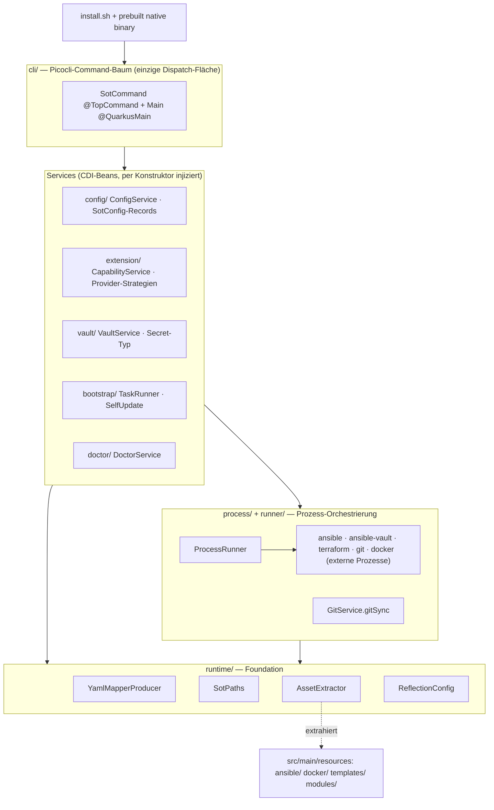

# SOT — Rewrite-Plan: Bash → natives Java-CLI (Quarkus + GraalVM)

> **Richtungsentscheidung:** SOT wird **komplett** von Bash auf ein **natives Java-CLI** umgebaut — **Java 21 + Quarkus 3.37+ + Picocli + GraalVM/Mandrel native-image**, als ein einzelnes selbstständiges Binary pro Plattform. Kein In-place-Bash-Refactoring mehr (der alte [`refactoring-plan.md`](./refactoring-plan.md) ist damit obsolet).
>
> **Grundlage:** Die bestehende Fähigkeits-/Befund-Inventur ([`refactoring-findings.md`](./refactoring-findings.md), 88 Befunde) ist die **funktionale Spezifikation** — jede heute vorhandene Fähigkeit muss im Java-CLI erhalten bleiben, und jeder der 88 Bugs muss im Neubau entweder **strukturell verschwinden** oder **bewusst gehärtet** werden. Der Ziel-Entwurf wurde von 9 Architektur-Agenten je Schicht entworfen; Quarkus/Picocli-Fakten sind gegen die aktuelle Doku (Context7) geprüft.

---

## 1. Zielbild in einem Satz

Aus ~10 000 Zeilen dynamischem Bash wird **eine typisierte, DI-verdrahtete Java-Anwendung**, die zu **einem nativen Binary** kompiliert (schneller Start, kein JVM/Runtime nötig) und die **externen Tools (ansible, ansible-vault, terraform, git, docker) weiterhin per Prozessaufruf orchestriert**. Die Ansible-Playbooks, Docker- und Vault-Templates werden **nicht** zu Java — sie bleiben deklarative Assets, die als Classpath-Ressourcen eingebettet und zur Laufzeit von Java extrahiert und aufgerufen werden.

**Warum das die 88 Bugs erschlägt:** Die überwältigende Mehrheit der Befunde sind **Artefakte des Bash-Modells** — String-Dispatch, `source`-Laden, Wort-Splitting, positionale argv-Übergabe, YAML-Parsing per `cut`/`xargs`, CI per Verzeichnis-Glob. In einem **typisierten, CDI-verdrahteten Single-Binary-Design sind diese Bug-Klassen per Konstruktion unmöglich** (siehe Mapping §5). Ein kleiner Rest bleibt echtes Engineering (native-image-Constraints, Secret-Handling, Linking) — der wird in §7/§9 explizit adressiert.

**Was ausdrücklich NICHT verschwindet:** Die **Ansible-Modul-Bugs (Befund-Thema L, 10 Stück** — UFW `policy: allow`, `readVaultParameter`-Rollenname, `/etc/hosts`-Regex, Vault-Passwort-Lifecycle, OS-Abstraktion …) leben in den Playbooks weiter, weil Ansible bleibt. Sie müssen **bei der Portierung der YAML-Assets aktiv gefixt** werden — der Java-Umbau löst sie nicht auf. (Eigener Task in Phase 6.)

---

## 2. Ziel-Stack

| Ebene | Wahl | Warum |
|---|---|---|
| Sprache | **Java 21** (LTS) | Records, sealed types, virtual threads, Pattern Matching — ideal für typisierte Config & Prozess-Draining |
| Framework | **Quarkus 3.37+** | Auf GraalVM native zugeschnitten; Build-Time-DI (Arc) statt Runtime-Scanning → passt zur Closed-World-Annahme von native-image |
| CLI | **quarkus-picocli** (Picocli) | Deklarativer Command-Baum, CDI-Injektion in Commands, `AutoComplete.GenerateCompletion` erzeugt bash/zsh-Completion aus dem lebenden Spec |
| Config | **quarkus-jackson + jackson-dataformat-yaml** | Ein Parser (SnakeYAML-Tokenizer) statt 4 Bash-Parser; typisierte Records; `#`/Quote/Backslash-Korruption unmöglich |
| Validierung | **quarkus-hibernate-validator** | Bean-Validation auf Config-Records (Port-Range, Namens-Pattern) |
| Templating | **quarkus-qute** (`@CheckedTemplate`) | Typsicheres Vault-Template ohne Runtime-Reflection (native-freundlich) |
| Native | **Mandrel/GraalVM CE 21** (`-Dnative`) | Ein Binary je Plattform; `quarkus.native.resources.includes` bettet Assets ein |
| Build | **Maven** (+ Wrapper) | Quarkus-Primärtoolchain; `mvn …:create -Dextensions='picocli'` |
| Release | **JReleaser** + GitHub Actions Matrix | Per-Plattform-Binaries, Checksums, SBOM (Syft), Signaturen (cosign) auf GitHub Releases |
| Verbleibende Shell | **genau ein** `install.sh` | Erkennt OS/Arch, lädt das passende Binary + Checksum, verifiziert, verlinkt |

**Bootstrap-Kommandos (verifiziert):** Projekt: `mvn io.quarkus.platform:quarkus-maven-plugin:3.37.0:create -DprojectGroupId=de.jklein.sot -DprojectArtifactId=sot -Dextensions='picocli,quarkus-jackson'`. Native-Build: `./mvnw install -Dnative` (bzw. `-Dquarkus.native.enabled=true`). Completion: `source <(sot generate-completion)`.

---

## 3. Ziel-Architektur

### Schichten



### Package-Baum (`de.jklein.sot.*`)

```
de.jklein.sot/
├── cli/         Picocli-Command-Baum: SotCommand(@TopCommand) · Main(@QuarkusMain) · {Bootstrap,Doctor,Vault,
│               Runner,Extensions,Plugins,Update,Delete,Interactive}Command · SotVersionProvider · AliasExpander
│               · AliasCheatSheetRenderer · ConsoleService/ProgressReporter · SotExitCode
├── config/      SotConfig + {System,Ssh,Logging,Paths,Tools,Ansible,Runner,Vault}Config · ExtensionConfig
│               · GeneratedValue(enum) · YamlConfigCodec · ConfigMerger · PlaceholderResolver · ConfigValidator
│               · SecretStore · ConfigService   (EINE kanonische, verschachtelte, typisierte Schema-Quelle)
├── extension/   CapabilityProvider(interface) · LocalDirectoryProvider · RemoteGitProvider · CapabilityRegistry
│               · CapabilityService · ExtensionManifest · Capability · CapabilityType · CapabilityStateStore
│               · ManifestParser · SafeFsRemover   (module=plugin=extension=integration → EIN Konzept)
├── vault/       Secret(AutoCloseable char[]) · VaultPasswordSource(sealed) · SecretResolver · TransientPasswordFile
│               · PosixGuards · AnsibleVaultRunner · SecretGenerator · VaultTemplateRenderer · VaultSecrets · VaultService
├── process/     ProcessRunner(interface)+Impl · ProcessSpec/ProcessResult · ProgressSink/TeeSink · SecretMaterializer
│               · GitService/GitSyncSpec · WorkspaceManager · ToolPreflight
├── runner/      AnsiblePlaybookInvocation · AnsibleVaultInvocation · TerraformInvocation · DockerInvocation (typed arg-builder)
├── bootstrap/   BootstrapTask(interface) + {Preflight,MaterializeAssets,DirectoryLayout,DependencyInstall,VaultReference,
│               Finalize}Task · TaskRunner · TaskResult/BootstrapReport · InstallLayout · DependencyInstaller
│               · GitHubReleaseClient · ChecksumVerifier · BinaryUpdater · BuildInfo
├── doctor/      DoctorService
└── runtime/     YamlMapperProducer · SotPaths · AssetExtractor · ReflectionConfig

src/main/resources/   application.properties · config/default_config.yml · templates/vault/secrets.yml (Qute)
                      · ansible/** · docker/** · modules/**/module.yml · assets/manifest.txt (build-generiert)
repo-root/            pom.xml · mvnw · install.sh · jreleaser.yml · .pre-commit-config.yaml
                      · .github/workflows/{ci,native-build,release}.yml
```

### Sieben Architektur-Prinzipien

1. **Ein Dispatch-Pfad.** `CommandLine.execute(args)` in `Main`. Kein `case`, kein Registry-vs-Filesystem-Dual, keine leeren Command-Pfade. Aliase sind `@Command(aliases=…)` — ein toter Alias ist **nicht kompilierbar**.
2. **State per Konstruktor-Injektion, nie per argv.** Der positionale `CLI_METADATA_ARGS`-Contract (R3) existiert nicht mehr; Commands bekommen `SotConfig`, `SotPaths`, `VaultService` etc. als typisierte Beans.
3. **Ein YAML-Parser, ein Schema.** `YamlMapperProducer` liefert **den einen** Jackson-`YAMLMapper`; Config sind unveränderliche Records. Die 4 Bash-Parser und das v1/v2-Schisma sind weg.
4. **Ein Erweiterungs-Konzept.** `CapabilityProvider` mit zwei Strategien (lokales Verzeichnis / entferntes Git-Repo) hinter **einer** Registry + einem Lifecycle. `integration`-Typ und Legacy-Kommando entfallen.
5. **Secrets sind ein Typ, kein String.** `Secret` (AutoCloseable `char[]`, `toString()="****"`, `close()` nullt) — nie auf argv, nie im Config-YAML, nie im Log. `no_log` wird zur Typ-Eigenschaft.
6. **Ein Install-Root, ein Binary.** Alle Pfade aus **einem** `rootDir`. Kein Doppel-Clone, kein `/opt/AAT`-Fallback, kein CLI-Sed-Patch. Der ausgeführte CLI **ist** der installierte.
7. **Build-Time-Wahrheit.** Command-Baum, Provider-Liste, Task-Liste, Completion, Hilfe, Version werden zur **Build-Zeit** aufgelöst (Closed-World). Erweitern = ein Bean hinzufügen, nicht ein `.sh` zur Laufzeit ablegen.

---

## 4. Was sich **nicht** ändert (Scope-Grenze)

- **Ansible / Terraform / Docker bleiben.** Sie werden als externe Prozesse orchestriert; Playbooks/Rollen/Templates sind eingebettete Assets. „Alles auf Java" heißt: **die gesamte Shell-Logik** wird Java — nicht die deklarativen Infrastruktur-Artefakte (die zu Java zu machen wäre absurd).
- **Die Ziel-Fähigkeiten** (bootstrap, doctor, vault, runner, extensions, plugins, update/self-update, delete, help, version, interactive, completion) bleiben identisch aus Nutzersicht — nur robuster und sicherer.
- **YAML als Config-Format** bleibt (verschachtelt), nur eben typisiert geladen.

---

## 5. Capability-Mapping: Bash → Java

**Legende:** **[S]** = löst sich *strukturell* auf (das Java-Design macht den Befund per Konstruktion unmöglich) · **[C]** = braucht *bewusste Härtung* (Restrisiko bleibt, wird mitigiert — siehe §7/§9).

| Bash-Datei / Subsystem | Ersetzt durch (Java) | Grundursache / Thema |
|---|---|---|
| `bin/sot` (Pfad-Bootstrap, `CLI_METADATA_ARGS`, `case`-Dispatch, `resolve_command_path`, interaktiv) | `cli.Main` + `SotCommand`-Baum + Konstruktor-Injektion | **R3** positional argv; **A** Doppel-Dispatch — [S] |
| `lib/cli/registry.sh` (register/help/menu/completion-Gen) | `SotCommand`-Baum + `AliasCheatSheetRenderer` + `InteractiveCommand` | **A/I** Registry-vs-FS; Hilfe-Drift; leere Plugin-Pfade — [S] |
| `lib/cli/aliases.sh` | picocli `@Command(aliases=…)` + `AliasExpander` | **F** toter `s`→setup-127-Exit; tote/Multi-Wort-Aliase — [S] |
| `lib/cli/progress.sh`, `colors.sh` + 6 kopierte ANSI-Blöcke | `cli.ConsoleService` / `ProgressReporter` (ein Binary) | **R6** Farb-Duplikation; **E** — [S] |
| `completions/*.{bash,zsh}` | picocli `AutoComplete.GenerateCompletion` | **R7/I** Completion-Triplikation + Drift — [S] |
| `lib/core/yaml_parser.sh`, `parse_plugin_yaml`, `config_defaults`-Regex, `default_config{,_v2}.yml` | `YamlConfigCodec` + `YamlMapperProducer` + **ein** `default_config.yml` + `SotConfig`-Records | **R1** 4 Parser/Schema-Split; **D** flach-vs-verschachtelt; **G** `#`-Truncation/`xargs`-Korruption; **H** `PATH`/`IFS`-Key-Injection — [S] |
| `config_defaults.sh` (`generate_dynamic_defaults`) | `PlaceholderResolver` + `GeneratedValue` + `ConfigValidator`-Gate | **F** `__GENERATE_SCRIPTS_DIR__` landet auf Disk — [S] |
| `config_writer.sh`, `sed`, `save_plugin_state`, `overrides/` | `ConfigService.save` + `ConfigMerger` | **D** 3 Mutations-Pfade + unimplementierte Overrides — [S] |
| `lib/plugins/manager.sh` + `lib/extensions/manager.sh` + `commands/extensions.sh` (3 Manager, 4 Begriffe) | `CapabilityRegistry` + `CapabilityService` + `CapabilityProvider`-Strategien | **R2/B** vier Begriffe, drei disjunkte Subsysteme — [S] |
| `modules/*/module.yml`, `parse_plugin_yaml`, `PLUGIN_DEPENDENCIES` | `ExtensionManifest` + `ManifestParser`; topologische Dep-Auflösung | **B** Schema-vs-Parser; ignorierte Deps; Typ-Taxonomien — [S] |
| `_update_config_value` / `save_plugin_state` (persistiert nie) | `CapabilityStateStore` | **B/F** Persistenz-Lüge — [S] |
| `commands/vault.sh`, `roles/{vault,read_vault_parameter}`, `vault_template.j2` | `VaultService` + `AnsibleVaultRunner` + `Secret` + `TransientPasswordFile` + `VaultTemplateRenderer` | **R5/H** Secret auf argv, Klartext in Config, persistente `vault_pass.txt`, Debug-Dump, schwache Defaults, fehlende view/rekey — [S]; Symlink-Race, tmpfs-Garantie, Secure-Delete — [C] |
| `commands/runner.sh` (ansible/terraform, tee, sync_repo), `trigger.sh` | `ProcessRunner` + `runner.*Invocation` + `TeeSink` + `ToolPreflight` | **R3/R6** positional argv + duplizierter Arg-Bau — [S] |
| Git-Clone (`init.sh`/`tasks.sh`), `manager.sh` fetch+pull, `update.sh` `reset --hard`+`clean` | `GitService.gitSync(GitSyncSpec, PULL/RESET_HARD)` | **R6** 4 Git-Sync-Stellen; **G** ungeschützter Reset — [S]; RESET_HARD-Datenverlust — [C] |
| `bootstrap/init.sh` curl\|bash Selbst-Clone + re-exec + re-clone | `install.sh` (dünn) + Prebuilt-Binary + `InstallLayout` | **R4** zwei Roots; **C** Selbst-Clone/CLI-Edit/`SETUP_DIR` — [S]; Root-Default-Wahl — [C] |
| `bootstrap/{tasks,runner,args_parser}.sh` | `BootstrapTask`-Beans + `TaskRunner` + `BootstrapReport` | **F** „immer erfolgreich"-Lüge; unparste `$1/$2` — [S] |
| `bootstrap/dependencies.sh` | `DependencyInstaller`-Strategien | **F** still verworfene `-tools`-Tokens — [S] |
| `commands/maintenance/update.sh` | `SelfUpdateCommand` + `BinaryUpdater` + `ChecksumVerifier` + `GitHubReleaseClient` | **G/H** ungeschützter Reset; unverifiziertes Update — [S]; Cross-Device-Move, TLS/CA — [C] |
| `commands/maintenance/delete.sh` (safe-delete, vault-backup) | `SafeFsRemover` + `PathGuardTest`-Denylist | **R5/H** `rm -rf` auf Config-Pfade + sed-Injection; Secret in `/tmp/BACKUP_INFO.txt` — [S] |
| `lib/init.sh` Source-Loader/Doppel-Sourcing, `SOT_ROOT`-Probing | `runtime.SotPaths` + Arc-Bean-Graph | **R4/E** Load-Modell, Doppel-Source, `SCRIPT_ROOT`-Drift — [S] |
| `modules/ansible/**`, Templates, Docker (loser Baum) | `src/main/resources/**` + `AssetExtractor` (+ `assets/manifest.txt`) | Asset-Embedding für native — [S]; Manifest-Vollständigkeit — [C] |
| **`modules/ansible/roles/*` INHALT (UFW, Rollenname, hosts-Regex, Vault-Lifecycle, OS-Abstraktion)** | **portierte, gefixte Ansible-Assets** (bleiben YAML) | **Thema L (10 Befunde)** — **NICHT [S]/[C], sondern manuell zu fixen** ⚠️ |
| `tests/*.sh` + Mock-`ansible-vault` | `@QuarkusTest` + `RecordingProcessRunner` + `FakeToolPathResource` + `ConfigRoundtripTest` + `VaultBehaviorTest` | **K** grep-String-Tests, `set -e`-Counter, Null-Coverage, bash≥4/macOS-3.2 — [S] |
| `.github/workflows/{test,lint,security,deploy}.yml`, `.pre-commit-config` | `ci.yml` + `native-build.yml` + `release.yml` + `jreleaser.yml` | **R7** False-Green `security.yml` `\|\| true`, `ci/`-Drift; **I** — [S]; native musl/exec — [C] |

**Bilanz der 88 Befunde:** ~geschätzt **60+ lösen sich strukturell [S]** (Themen A, B, D, E, F, I, J, K + R1/R2/R3/R4-Layout/R6/R7). **~8–10 brauchen bewusste Härtung [C]** (native Reflection/Ressourcen, Linking, Secret-Härtung, Legacy-Migration, Self-Replace, Manifest-Vollständigkeit). **10 (Thema L) lösen sich gar nicht** — sie müssen in den portierten Ansible-Assets **aktiv gefixt** werden (Phase 6).

---

## 6. Native-Image-Constraints (die echten Fallstricke)

| Bereich | Was zu tun ist |
|---|---|
| **Reflection** | `@RegisterForReflection` auf **alle** Jackson-Records (`SotConfig` + Sektionen, `ExtensionManifest`, `VaultSecrets`, GitHub-Release-DTOs) **zentral in `ReflectionConfig`** — sonst Runtime-Fehler „missing constructor". Picocli-`IVersionProvider`/`IHelpSectionRenderer`/`IExitCodeExceptionMapper`/`GenerateCompletion` ebenfalls registrieren. |
| **Ressourcen** | `quarkus.native.resources.includes=ansible/**,docker/**,templates/**,config/**,modules/**,assets/manifest.txt` — sonst fehlen die Assets im Binary. Ein natives Binary kann Classpath-Ressourcen **nicht `Files.walk`en** und **nicht direkt exec**en → `AssetExtractor` iteriert das build-generierte `assets/manifest.txt` und kopiert jede Ressource (idempotent, content-hash, 0700) in ein beschreibbares Verzeichnis, **bevor** ProcessBuilder ansible/git/docker aufruft. |
| **Closed-World** | Kein `Class.forName`, kein Runtime-Scanning. CDI-Beans, Command-Baum, `@All List<CapabilityProvider>`, `@All List<BootstrapTask>` werden zur Build-Zeit aufgelöst. |
| **Build- vs Runtime-Init** | `$SOT_HOME`/Env zur **Laufzeit** lesen (`SotPaths @ApplicationScoped`); `YAMLMapper` build-time via `@Produces`; Version/Commit als generierte `BuildInfo`-Ressource (kein Runtime-`git`); `SecureRandom` `--initialize-at-run-time`. |
| **Charsets** | `quarkus.native.add-all-charsets=true` + UTF-8 `file.encoding` (deutsche Ausgabe, Non-ASCII-Vault) — im Native-Smoke-Test prüfen. |
| **Prozess-Exec + Linking ⚠️** | `ProcessBuilder` nutzt `posix_spawn`. **ABER: voll-statische (musl) native Images können nicht fork/exec** — und das ganze Tool ruft externe Prozesse auf. Linux daher **mostly-static (glibc) oder dynamisch**, **nicht** `--static --libc=musl`. CI muss echten Subprozess-Aufruf aus dem gebauten Binary beweisen. |
| **TLS (Self-Update)** | JDK-`HttpClient` über TLS braucht `quarkus.ssl.native=true` + eingebetteten CA-Truststore (mit Override). SHA-256 via `MessageDigest` ist Default. |

---

## 7. Offene Entscheidungen (vor bzw. in Phase 0 zu fixieren)

Der Multi-Agenten-Entwurf hat echte Widersprüche zwischen den Schichten aufgedeckt. Empfehlung je Zeile; die mit ⚠️ sind **load-bearing**.

| # | Entscheidung | Empfehlung | Anmerkung |
|---|---|---|---|
| **D1** ⚠️ | **Native-Linking:** static-musl vs mostly-static-glibc | **mostly-static glibc / dynamisch** | **Keine echte Wahl, sondern Korrektheits-Constraint:** static-musl kann nicht fork/exec → Tool wäre kaputt. Zwei Schicht-Entwürfe hatten fälschlich musl-static gewählt. |
| **D2** | **Root-Package / groupId** | `de.jklein.sot` (= groupId) | Agenten schlugen 5 verschiedene vor; auf einen normiert. |
| **D3** | **Install-Root + Symlink** | Root `/opt/sot`, Symlink `/usr/local/bin/sot`; `SotPaths` & `InstallLayout` zu **einem** Pfadmodell mergen | Löst R4; bestätige die Pfadwahl. |
| **D4** | **Vokabular „Capability" vs „Extension"** | **Extension** durchgängig (User-Term = `sot extensions`/`ex`); interne Klassen konsistent benennen | Aktuell mischt der Entwurf `Capability*`-Klassen mit `extension/`-Package. |
| **D5** | **`ProcessRunner`** Interface vs konkret | **Interface + `ProcessRunnerImpl`** | Tests brauchen das Interface (`@InjectMock`/`@Alternative`). |
| **D6** | **Geteilte Beans deduplizieren** | je **ein** `YAMLMapper`, **ein** `Secret`-Typ, **ein** `SecretMaterializer`, **ein** `AssetExtractor`, **ein** `ProcessRunner` | Mehrere Schichten beanspruchten dieselbe „single source" — genau einmal implementieren. |
| **D7** | **macOS-Scope** | **v1: Linux nativ (primär); macOS nur JVM/Dev.** Natives macOS-Binary + Vault-tmpfs-Strategie später | macOS hat kein `/dev/shm`; native Static-Linking ist ohnehin Linux. **Bitte bestätigen.** |
| **D8** | **Self-Update** | Beide: `install.sh` (Erstinstallation) + `sot self-update` (Upgrade), **beide** verifizieren Checksum **+ cosign** | Angleichen (eine Schicht hatte nur `shasum`). |
| **D9** | **Legacy-Config-Migration** | Einmal-Migrations-Reader (`FAIL_ON_UNKNOWN=false` + Key-Mapping) → schreibt kanonisches Schema, dann strikt | Nur nötig, falls **produktive SOT-Installationen im Feld** existieren — **bitte bestätigen** (sonst Greenfield). |
| **D10** | **`module.yml` `apiVersion`** | Von Anfang an mitführen (warn-not-fail-Fenster) | Deckt zugleich D9-Manifest-Evolution ab. |

---

## 8. Migrations-Phasen (Greenfield-Neubau, „Strangler" bis Parität)

Neubau in einem neuen Maven-Modul, **Fähigkeit für Fähigkeit**, jede Phase eine reviewbare PR mit **Abnahme-Gate**. Der alte Bash-Baum bleibt bis Phase 8 (Cutover) lauffähig als Referenz. Aufwand: **S** ≤ 2 Tage, **M** ≈ 3–5 Tage, **L** ≈ 1–2 Wochen (eine Person).

### Phase 0 — Projekt-Skelett & Foundation *(L · blockiert alles · fixiert D1–D6)*
Maven/Quarkus/Java-21-Setup; Package-Baum; `quarkus-picocli`-Hello-World `sot version`; `YamlMapperProducer`, `SotPaths`, `AssetExtractor`, `ReflectionConfig`, `application.properties` (resources.includes, add-all-charsets, Mandrel-Image); dünnes `install.sh`-Stub; `ci.yml` mit **JVM-Verify + einem linux-amd64-Native-Smoke** (`sot version` als Native-Binary). **Linking-Entscheidung D1 hier verifizieren** (Native-Binary ruft `git --version` erfolgreich auf).
**Gate:** `sot version` läuft als natives Binary in CI; Native-Binary kann einen externen Prozess starten (beweist mostly-static-glibc).

### Phase 1 — Config-Kern *(L · hängt an 0 · löst R1/D)*
`SotConfig`-Records (verschachtelt), `YamlConfigCodec`, `ConfigMerger`, `PlaceholderResolver` + `GeneratedValue`, `ConfigValidator`, `SecretStore` (0600-Referenz statt Secret-Feld). `default_config.yml` als einzige kanonische Vorlage.
**Gate:** `ConfigRoundtripTest` (`load(save(cfg))==cfg`, Golden-File, jqwik-Properties inkl. `#`/Quote/CRLF); Native-IT lädt `default_config.yml` und bindet alle Sektionen.

### Phase 2 — Prozess-/Exec-Engine *(M · hängt an 0 · löst R6/R3-argv)*
`ProcessRunner`(Interface)+Impl mit Virtual-Thread-Draining, `ProcessSpec/Result`, `TeeSink`, `GitService.gitSync` (PULL/RESET_HARD, `--force`-gated), `SecretMaterializer` (0600-Datei/stdin/env, nie argv), `WorkspaceManager`, `ToolPreflight`, typisierte `runner.*Invocation`-Records.
**Gate:** Tests mit `RecordingProcessRunner` (kein echtes ansible/git); Native-Smoke ruft echtes `git`/`echo` auf (härtet D1 endgültig ab).

### Phase 3 — CLI-Gerüst & Dispatch *(L · hängt an 1+2 · löst A/F-Dispatch, R3)*
`SotCommand`-Baum, `Main`, globale Optionen (`scope=INHERIT`), Hilfe/Version, `GenerateCompletion`, `@Command(aliases=…)` + `AliasExpander`, `InteractiveCommand`, `SotExitCode`, `ConsoleService`. Commands als dünne Schalen, die (teils gestubte) Services aufrufen.
**Gate:** `@QuarkusMainTest` e2e über `sot help`/`--help`/`generate-completion`/Exit-Codes; Completion deckt exakt den Command-Baum.

### Phase 4 — Vault & Security *(L · hängt an 1+2 · löst R5/H)*
`Secret`(AutoCloseable), `VaultPasswordSource`(sealed)+`SecretResolver`, `TransientPasswordFile`+`PosixGuards` (tmpfs-verifiziert, fail-loud), `AnsibleVaultRunner` (Passwort via Datei/stdin), `SecretGenerator`, Qute-`secrets.yml`, `VaultService` (init/view/edit/rekey/read — view+rekey **neu funktional**), `VaultCommand`.
**Gate:** `VaultBehaviorTest` (kein Secret in argv/`ps`, 0600-tmpfs-Datei, nach Nutzung weg); Container-IT: echter `ansible-vault` encrypt→decrypt-Roundtrip.

### Phase 5 — Extensions/Capability *(L · hängt an 1+2+3 · löst R2/B)*
`CapabilityProvider` + `LocalDirectoryProvider`/`RemoteGitProvider`, `CapabilityRegistry` (`@All`), `CapabilityService` (list/info/install/remove/enable/disable/sync/run), `ExtensionManifest`+`ManifestParser` (apiVersion), `CapabilityStateStore` (echte Persistenz), `SafeFsRemover`, `ExtensionsCommand`/`PluginsCommand`.
**Gate:** `ExtensionManagerTest` — install/enable/sync/**persist**-Roundtrip über beide Provider; kaputtes `module.yml` schlägt bei Discovery fehl.

### Phase 6 — Bootstrap, Runner & Ansible-Assets *(L · hängt an alle Services · löst C/F + Thema L)*
`BootstrapTask`-Pipeline + `TaskRunner`/`BootstrapReport` (ehrlicher Exit), `DependencyInstaller`-Strategien, `InstallLayout`, `RunnerCommand` verdrahtet die Invocation-Records, `AssetExtractor` der eingebetteten `ansible/`. **Zusätzlich: die portierten Ansible-Assets fixen** — UFW `deny`, Rollenname `read_vault_parameter`, `/etc/hosts`-Regex, Vault-Passwort-Lifecycle, OS-Abstraktion (`package` + `when: ansible_os_family`), `ansible_facts`-Missbrauch, Docker aus Trigger lösen (**Thema L**).
**Gate:** `sot bootstrap` bringt einen Wegwerf-Container in definierten Zustand; `ansible-lint` grün; Vault-encrypt→decrypt-Roundtrip in der Ansible-Rolle grün.

### Phase 7 — Self-Update, Packaging & Release *(L · hängt an 0 + App · löst R7)*
`GitHubReleaseClient`+`ChecksumVerifier`+`BinaryUpdater` (Sibling-Temp → verify → `ATOMIC_MOVE` → re-exec), JReleaser-Multi-Arch (linux amd64/arm64), `install.sh` vollständig (Checksum + cosign), `release.yml` (Tag `v*`), `native-build.yml`-Matrix, `.pre-commit-config` (Spotless/shellcheck-für-install.sh/yamllint/ansible-lint/gitleaks).
**Gate:** Getaggter Release erzeugt verifizierte Per-Plattform-Binaries; `install.sh` installiert sie; `sot self-update`-Roundtrip funktioniert.

### Phase 8 — Parität, Cutover & Legacy-Migration *(M · final)*
Volle Testabdeckung (extensions/bootstrap/config/doctor/maintenance); Legacy-`config.yaml`-Migrations-Reader (D9); **die 88-Befund-Regressions-Checkliste abarbeiten** (jedes [S] nachweislich weg, jedes [C] nachweislich mitigiert, Thema-L-Fixes verifiziert); alten Bash-Baum entfernen; README/Docs neu schreiben.
**Gate:** Paritäts-Checkliste 100 %; Bash entfernt; `refactoring-findings.md` vollständig abgehakt.

### Sequenz

```
Phase 0 (Skelett/Foundation, fixiert D1–D6)
   └─► Phase 1 (Config) ─┐
   └─► Phase 2 (Exec) ───┤
                         ├─► Phase 3 (CLI) ─► Phase 5 (Extensions)
                         ├─► Phase 4 (Vault)          │
                         └─► Phase 6 (Bootstrap+Runner+Ansible-Assets)
Phase 7 (Release/Self-Update)  ── ab Phase 0 vorbereitbar, voll ab lauffähiger App
Phase 8 (Parität/Cutover/Migration)  ── ganz zuletzt
```
**Kritischer Pfad:** 0 → 1/2 → 3 → 5/6 → 8. Phase 4 parallel ab 2; Phase 7 parallel ab 0.

---

## 9. Verifikationsstrategie

- **Drei Test-Tiers:** (1) `@QuarkusTest` JVM-Komponententests mit gemocktem `ProcessRunner` (nie echtes ansible/git); (2) `@QuarkusMainTest` CLI-e2e über `QuarkusMainLauncher`; (3) `@QuarkusMainIntegrationTest` **native** Black-Box-Smoke mit `FakeToolPathResource` (echte Fake-Tools auf PATH).
- **Native-Gate ist Pflicht:** Ein natives IT lädt Config, parst jedes echte `module.yml`, fährt einen Runner-Dry-Run — verwandelt Reflection-/Ressourcen-Fehler von Runtime-Überraschungen in gefangene CI-Fehler.
- **Paritäts-Checkliste** gegen `refactoring-findings.md`: jeder der 88 Befunde bekommt einen Status (dissolved-[S] / hardened-[C] / ansible-fixed-L) mit Test- oder Code-Nachweis. Das ist das Abnahmekriterium für Phase 8.
- **Verhaltens- statt Text-Tests** für Security (kein Secret in argv via `ps`; 0600-tmpfs).
- **CI failt hart** (kein `|| true`); SonarCloud-Quality-Gate als Required-Check.

---

## 10. Risiken & Gegenmaßnahmen (Top 8)

| # | Risiko | Gegenmaßnahme |
|---|---|---|
| 1 ⚠️ | **static-musl kann nicht fork/exec** (architektur-brechend) | **mostly-static glibc/dynamisch** bauen; libc im Asset-Namen; CI beweist Subprozess-Exec aus dem Binary vor jedem Release (D1) |
| 2 | Native Reflection/Ressourcen-Miss zeigt sich erst zur Laufzeit | Zentrale `ReflectionConfig`; Pflicht-Native-IT (Config-Load + alle `module.yml` + Runner-Dry-Run); Build-Assert, dass jeder `resources.includes`-Glob + `manifest.txt`-Eintrag auflöst |
| 3 | Secret-Restexposition (Heap-Copy, unsicheres Secure-Delete) | tmpfs(RAM)+0600+sofort-unlink+SecureRandom-Name+`O_EXCL`/`NOFOLLOW` (killt Symlink-Race 165); Overwrite = Best-Effort; try-with-resources; Core-Dumps aus; Restrisiko dokumentiert |
| 4 | tmpfs fehlt/ist Disk (Container, macOS) → Passwort auf Platte | `PosixGuards` verifiziert echtes tmpfs und **failt laut** statt still zu persistieren; gatet zugleich macOS (D7) |
| 5 | Legacy-`config.yaml` bricht striktes Binding | Einmal-Migrations-Reader (`FAIL_ON_UNKNOWN=false` + Key-Mapping) → kanonisch umschreiben, dann strikt (D9) |
| 6 | Destruktiver `RESET_HARD`-Datenverlust (aus `update.sh`) | `SyncMode.RESET_HARD` nur mit `--force`; Default `PULL`; eine auditierte `GitService`-Methode |
| 7 | Self-Replace scheitert Cross-Device/EACCES; TLS/CA bricht Download | Temp ins Zielverzeichnis, Checksum+cosign vor `ATOMIC_MOVE`, klare Fallback-Meldung bei EXDEV/EACCES; CA eingebettet + Override |
| 8 | Lange/flaky Multi-Arch-Native-Builds, Mandrel-Drift | PRs: JVM-Verify + 1× linux-amd64-Smoke; volle Matrix nur auf Tag (`fail-fast:false`); Mandrel-Version + Builder-Image-Tag pinnen; Renovate-Bumps müssen das Native-Gate bestehen |

---

## 11. Abhängigkeiten (Kurzliste)

**Runtime:** `quarkus-picocli`, `quarkus-arc`, `quarkus-jackson`, `jackson-dataformat-yaml` (SnakeYAML), `quarkus-hibernate-validator`, `quarkus-qute`.
**Test:** `quarkus-junit5`, `quarkus-junit5-mockito`, `quarkus-jacoco`, `assertj-core`, `jqwik`.
**Build/Release:** `quarkus-maven-plugin`, `jreleaser-maven-plugin`, `spotless-maven-plugin`, `jacoco-maven-plugin`, `sonar-maven-plugin`; Actions: `graalvm/setup-graalvm@v1` (Mandrel 21, gepinnt), `anchore/sbom-action` (Syft), `sigstore/cosign`.

---

## 12. Aufwand (Größenordnung)

Grobe Hausnummer für **eine erfahrene Person**: Phasen 0–8 summieren sich auf **~10–14 Wochen** (Skelett+Config+Exec+CLI je ~1–2 Wochen; Vault/Extensions/Bootstrap je ~1–2 Wochen inkl. Ansible-Asset-Fixes; Release ~1 Woche; Parität/Cutover ~1 Woche). Mit 2–3 Personen ab Phase 1 parallelisierbar (Config/Exec/Vault unabhängig) auf **~6–8 Wochen**. Das native-image-Gate früh (Phase 0) zu etablieren ist der wichtigste Risiko-Hebel.
