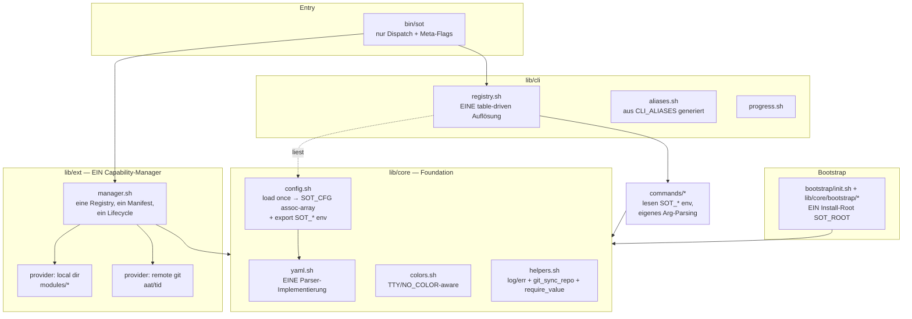

# SOT — Refactoring-Plan

> Erstellt aus einer tiefgehenden Analyse des gesamten Repos (10 Subsystem-Kartierungen + 5 Querschnitts-Audits, 88 deduplizierte Befunde: **27 High / 36 Medium / 25 Low**). Dieser Plan beschreibt **Zweck → Ist-Zustand → Ziel-Architektur → phasenweisen Umbau**. Er ist die Grundlage für die Umsetzung; es wurde noch **kein Produktivcode geändert**.
>
> Vollständige Befundliste mit `file:line` für jeden der 88 Befunde: [`docs/refactoring-findings.md`](./refactoring-findings.md) (Evidenz-Basis dieses Plans).

---

## 0. Zweck des Repos — was SOT ist

**SOT (Server Operation Toolkit)** ist ein **Bash-basiertes DevOps-Framework für reproduzierbares Setup und den Betrieb von Linux-Servern** (~10 000 Zeilen Shell). Der Kern liefert:

- ein **einheitliches CLI** (`bin/sot`, aufgerufen als `SOT <befehl>`), das Befehle auf Skripte auflöst und ausführt,
- eine **Shared Library** (`lib/`) mit Kernfunktionen (Farben, Logging, YAML-Parser) und CLI-Infrastruktur,
- ein **Bootstrap-System** (`bootstrap/` + `lib/core/bootstrap/`), das per `curl | bash` einen Server klont, konfiguriert und Tools installiert,
- ein **Erweiterungs-System** (heute doppelt: `plugins/` für lokale `modules/` + `extensions/` für externe Git-Repos wie AAT/TID),
- **Module** für Ansible (Host-/Container-Hardening, Vault), Docker und SDKMAN,
- **Config** als YAML, **Tests** (Bash-Harness) und **CI** (GitHub Actions).

**Wertversprechen:** Ein einziges CLI + eine deklarative Config bringen einen frischen Linux-Host reproduzierbar in einen definierten Zustand (SSH, Firewall, User, Secrets via Ansible-Vault, Container), erweiterbar über Plugins/Extensions.

---

## 1. Ist-Zustand — Diagnose

Das Repo befindet sich **mitten in drei unfertigen Umbenennungen**, deren Artefakte sich gegenseitig verstärken:

1. `setup` → `bootstrap` (Library + Kommando)
2. `integrations` → `extensions` (Erweiterungs-System)
3. Config **flach v1** → **verschachtelt v2**
4. Entfernung von `cli_wrapper.sh`

Die Umbenennungen wurden **nirgends vollständig durchgezogen**. Ergebnis: 88 Befunde, davon **27 High** — darunter **Datenverlust-Risiken** (Massen-User-Löschung), **Secret-Leaks** (Vault-Passwort im Klartext an mehreren Stellen) und **komplett kaputte Kern-Pfade** (`SOT runner` bricht ab, Config-Werte des Nutzers werden ignoriert). CI meldet trotzdem grün, weil Security-Scan und zwei Integrationstests ins Leere zeigen.

**Kernaussage:** Fast alle 88 Befunde sind **Symptome von 3 Grundursachen**. Wer die 3 Grundursachen sauber auflöst, eliminiert den Großteil der Einzelbugs strukturell — statt sie einzeln zu flicken.

---

## 2. Die drei Grundursachen (Root Causes)

| # | Grundursache | Was passiert | Betroffene Befunde |
|---|---|---|---|
| **R1** | **Config-Schema-Split** | `config_writer` schreibt **verschachteltes v2**, aber `bin/sot` liest es mit dem **flachen** Parser und der Ansible-Loader merged gegen **flache** Defaults. Verschachtelte Keys verlieren ihr Präfix (`ssh.port` → `$port` statt `$ssh_port`), `enabled`/`branch` kollidieren. **Die vom Nutzer gewählten Werte überschreiben nie die Defaults.** Dazu **3–4 parallele YAML-Parser** mit divergentem Verhalten und zwei inkompatible Default-Dateien. | Thema D (11), Teile von G, K, L |
| **R2** | **Extensibility-Split** | **Vier Begriffe** (module/plugin/extension/integration) für **ein** Konzept, umgesetzt in **drei disjunkten Subsystemen** (`lib/plugins/manager.sh`, `lib/extensions/manager.sh`, `commands/extensions.sh`) ohne gemeinsamen Code — getrennte Discovery, Config, Lifecycle, CLI-Pfad, sogar getrennte Sourcing-Einstiegspunkte. Persistenz fehlt (`save_plugin_state` nirgends definiert; `_update_config_value`-Guard schlägt immer fehl). | Thema B (6), Teile von A, F |
| **R3** | **Framework-State-Übergabe** | Kind-Skripte bekommen Framework-Zustand über einen **10-Slot-Positional-Contract** (`CLI_METADATA_ARGS`), **hinter** die User-Args gehängt — von drei Skripten **unterschiedlich** interpretiert (nur korrekt bei null User-Args). Config-Variablen sind **nie `export`ed**, also lesen env-basierte Kommandos leere Werte. Zusätzlich landet das **Vault-Secret auf der Kommandozeile** (`ps aux`). | Thema E (5), Große Teile von F + H |

Sekundäre, aber eigenständige Ursachen:

| # | Ursache | Wirkung |
|---|---|---|
| **R4** | **Zwei Install-Roots** (`/opt/SOT` vs `/etc/DevOpsToolkit`) + `/opt/AAT`-Fallback | Doppel-Clone; der gepatchte CLI und der verlinkte CLI sind **verschiedene Bäume**; Config nicht auffindbar |
| **R5** | **Unsicheres Secret-Handling** | Vault-Passwort im Klartext in world-readable `config.yaml`, auf argv, in persistenter `vault_pass.txt`, in `/tmp`-Backup, plus Full-Vars-Debug-Dump |
| **R6** | **Fehlende gemeinsame Helfer** | Git-Sync 4× reimplementiert (mal harmlos, mal `reset --hard`), Farb-Fallback 6× kopiert, Arg-Parsing 25×, Dispatch doppelt |
| **R7** | **Docs/CI/Tests-Drift** | Docs beschreiben ein Repo, das nicht mehr existiert (`ci/`, `integrations`, alte Pfade); CI grün trotz kaputter Scans/Tests |

---

## 3. Ziel-Architektur



**Leitprinzipien der Ziel-Architektur:**

1. **Ein Config-Schema, ein Parser, ein Ladepfad.** Config wird **einmal** in ein Assoziativ-Array + `export SOT_*` geladen. Jeder Lesezugriff geht durch `lib/core/yaml.sh`. Kein zweiter Parser, keine zweite Default-Datei.
2. **Ein Erweiterungs-Konzept.** module = plugin = extension = "**Extension**". Eine Registry, ein Manifest-Contract (`module.yml`), ein Lifecycle. Eine Extension bezieht ihren Code entweder aus einem **lokalen Verzeichnis** oder einem **entfernten Git-Repo** — zwei Provider-Strategien hinter **einem** Interface. `integration`-Typ und Legacy-`integrations`-Kommando entfallen.
3. **Kein Positional-Metadata-Contract.** Framework-Zustand fließt ausschließlich über **exportierte `SOT_*`-Env-Variablen**. Kommandos parsen ihre eigenen User-Args frei. Secrets nie auf argv.
4. **Ein Install-Root.** Alle Pfade werden aus **einer** `SOT_ROOT`-Konstante abgeleitet. Der ausgeführte CLI **ist** der gepatchte/verlinkte CLI.
5. **Secrets-by-reference.** Config speichert nur einen **Verweis** auf eine `0600` root-owned Passwortdatei; `config.yaml` selbst `chmod 600`; kein Secret in argv/logs/tmp; Ansible mit `no_log` + `tempfile`.
6. **DRY-Foundation.** Ein `git_sync_repo`, ein `require_value`, ein Farb-Fallback, ein Scaffolding-Snippet, eine Test-Assert-Bibliothek. Strict-Mode (`set -euo pipefail`) in **jedem** ausgeführten Skript.
7. **Generierte Wahrheit.** Hilfe, Aliase, Completions und Command-Docs werden **aus der lebenden Registry generiert**, nicht handgepflegt.

---

## 4. Offene Entscheidungen (vor Umsetzungsstart bestätigen)

Diese Weichen bestimmen das Zielbild. Ich gebe eine begründete Empfehlung; bitte bestätigen oder umlenken.

| # | Entscheidung | Empfehlung | Begründung |
|---|---|---|---|
| **E1** | **Config-Schema** flach v1 **oder** verschachtelt v2? | **Verschachtelt v2** als kanonisch; `bin/sot`-Parser flacht deterministisch zu `section_key` ab. `default_config.yml` (v1) löschen. | `config_writer` erzeugt bereits v2; README/Docs/Tests referenzieren v2; verschachtelt skaliert besser. Der einzige Grund für v1 (weniger Parser-Aufwand) entfällt, sobald es nur **einen** Parser gibt. |
| **E2** | **Install-Root** `/opt/SOT` **oder** `/etc/DevOpsToolkit`? | **`/opt/SOT`** als Programm-Root; Runtime-State (`config.yaml`, `.settings`, Logs) unter `/opt/SOT/<branch>/` bzw. einem dedizierten Data-Dir. `/opt/AAT`-Fallback entfernen. | `/opt` ist der FHS-Ort für Zusatz-Software; `/etc` ist für Config, nicht für Programme. `bin/sot` defaultet ohnehin auf `/opt/SOT`. Ein Root statt Doppel-Clone. |
| **E3** | **Umsetzungsstil** Big-Bang **oder** inkrementell (Phasen-PRs)? | **Inkrementell**, eine PR pro Phase, jede grün. | 27 High-Bugs + kaputtes CI ⇒ zuerst ein vertrauenswürdiges Sicherheitsnetz, dann tragende Umbauten. Big-Bang wäre unreviewbar. |
| **E4** | **Migration bestehender Installationen** unterstützen? | **Nein** (Greenfield-Annahme), sofern keine produktiven SOT-Installationen existieren. Sonst: ein `sot migrate`-Einmalskript in Phase 1. | Reduziert Komplexität massiv. **Bitte bestätigen, dass es keine Installationen im Feld gibt, die einen automatischen Config-Migrationspfad brauchen.** |
| **E5** | **Sprache der Doku/Commit-Messages** | **Deutsch** (Repo-Konvention beibehalten). | Konsistenz mit bestehender Doku und Git-Historie. |

---

## 5. Refactoring in Phasen

Jede Phase = eine reviewbare Einheit mit **Abnahme-Gate** (grün, bevor die nächste startet). Aufwand: **S** ≤ 0.5 Tag, **M** ≈ 1–2 Tage, **L** ≈ 3–5 Tage (Richtwerte für eine Person).

---

### Phase 0 — Sicherheitsnetz & Stop-the-Bleeding *(Aufwand: M · Risiko: niedrig · keine Abhängigkeiten)*

Zweck: **Vertrauenswürdiges CI** und **Entschärfung der katastrophalen Bugs**, bevor irgendetwas Tragendes angefasst wird. Reine Bug-/Guard-Fixes, keine Architektur.

| Task | Befund | Aufwand |
|---|---|---|
| `cleanup_old_users.sh`: bei leerem `currentUsername` **fail-closed**, User zwingend per Name verlangen | G/high `cleanup_old_users.sh:29,55,61-63` | S |
| `safe_delete()`: Denylist-Guard (absolut, nicht-leer, Mindest-Tiefe, kein `/`,`/usr`,…) vor jedem `sudo rm -rf` | G/med `delete.sh:127-158` | S |
| `update.sh`: `--force`-Gate implementieren **oder** Flag entfernen; destruktives `git reset --hard`/`clean` hinter Bestätigung | G/high `update.sh:49,58,150-152` | S |
| Zwei rote Integrationstests fixen (`grep "setup"`→`bootstrap`; `commands/integrations`-Check entfernen) | K/high `integration.sh:56,78` | S |
| Test-Harness extrahieren `tests/lib/assert.sh` — `set -e`-Counter-Footgun (`((x++))` → `x=$((x+1))`) an allen Stellen | K/high `helpers.sh:22`, `setup.sh:24`, `yaml.sh:20` | M |
| `security.yml`: ShellCheck-Globs auf **reale** Verzeichnisse (`lib/ commands/ bootstrap/ tests/`), `|| true` entfernen → kein False-Green mehr | I/high `security.yml:57-70` | S |

**Gate:** `tests/run-all.sh` grün · `security.yml` läuft strikt gegen echten Code · manuelle Prüfung: `cleanup_old_users` ohne Argument löscht nichts.

---

### Phase 1 — Foundational Contracts *(Aufwand: L · Risiko: hoch · blockiert 2,3,5,7)*

Zweck: Die **drei Grundursachen R1/R3/R4** auflösen. Das ist der load-bearing Umbau; danach werden viele Einzelbugs gegenstandslos.

**1a — Ein YAML-Parser, korrekt (R1-Teil 1).**
- `lib/core/yaml_parser.sh` zur **einzigen** Implementierung machen; `parse_plugin_yaml` (manager.sh) und den Inline-Loop in `config_defaults.sh` darauf umstellen.
- Parser-Korruption fixen: `\r` strippen; **nur** whitespace-vorangestelltes `#` außerhalb von Quotes als Kommentar; Trimmen via Parameter-Expansion statt `xargs`; gepaarte Quotes entfernen.
- Var-Namen-Zuweisung **allowlisten/namespacen** (kein Clobbern von `PATH`/`IFS`/`LD_*`).
- *Befunde:* G/high (`#`-Truncation, `xargs`), D/high (4 Parser), H/med (Var-Injection).

**1b — Ein Config-Schema + ein Ladepfad (R1-Teil 2, hängt an E1).**
- Kanonisches Schema festlegen (Empfehlung v2). `lib/core/config.sh`: **einmal** laden → `SOT_CFG`-Assoziativ-Array + deterministisches `export SOT_*`.
- `bin/sot`, `config_defaults.sh`, `modules/ansible/config/load_config.yml`, `runner.sh get_cfg` auf **diesen einen** Pfad umstellen. Zweite Default-Datei + toten Integrations-Block + `scripts_dir` löschen.
- *Befunde:* D/high×3, D/med×4.

**1c — Positional-Contract → exportierte Env (R3).**
- `CLI_METADATA_ARGS` löschen; `execute_script` ruft Kommandos **ohne** angehängte Metadaten. Framework-State kommt aus `SOT_*`-Env.
- `bootstrap.sh`, `vault.sh`, `delete.sh`, `extensions.sh` auf Env umstellen + **eigenes** Arg-Parsing (damit `--check`/`--tags`/`edit` wieder funktionieren).
- Vault-Secret aus argv entfernen (Übergang zu Datei-Referenz, Vollausbau in Phase 4).
- *Befunde:* E/high, F/high (`bootstrap --check`, `vault edit`, extensions-Persistenz, delete-Backup), H/high (argv-Leak).

**1d — Ein Install-Root (R4, hängt an E2).**
- Doppel-Clone `/opt/SOT` vs `/etc/DevOpsToolkit` eliminieren; alle Pfade aus **einer** `SOT_ROOT`-Konstante ableiten (CLI-Datei, Modules, Symlink). `/opt/AAT`-Fallback entfernen.
- `SETUP_DIR`→`BOOTSTRAP_DIR` (toter `setup/`-Pfad), `vault_template`-Pfad reparieren, `__GENERATE_SCRIPTS_DIR__` auflösen, `task_edit_cli`-Toter-Sed entfernen.
- *Befunde:* C/high×3, C/med, F/high (SCRIPTS_DIR, task_edit_cli).

**Gate:** `SOT bootstrap` schreibt Config, die `SOT` **wieder korrekt liest** (Roundtrip-Test); `SOT vault edit`, `SOT bootstrap --tags x` funktionieren; ein Install-Root; neue Unit-Tests für Parser-Edgecases (`#`, Quotes, CRLF) grün.

---

### Phase 2 — Extensibility vereinheitlichen *(Aufwand: L · Risiko: hoch · hängt an Phase 1)*

Zweck: **R2** auflösen — ein Capability-Manager statt zwei.

- `lib/plugins/` + `lib/extensions/` → **`lib/ext/manager.sh`**: eine Registry, ein Lifecycle (enabled/list/info/run/install/remove), zwei Provider-Strategien (local dir / remote git).
- **Manifest-Contract** (`module.yml`) und Parser in Übereinstimmung bringen: entweder auf flache Keys beschränken **oder** echtes YAML + versioniertes Schema + Validierung bei Discovery. `requirements/config/playbooks/roles/templates` entweder konsumieren oder streichen.
- **Persistenz reparieren**: ein `config_set`-Helfer (aus Phase 1) für `<name>_enabled`; `save_plugin_state` real implementieren; die **dritte** enable/disable-Kopie in `extensions.sh` löschen.
- `integration`-Typ + Legacy-`integrations`-Kommando + tote Multi-Wort-Aliase entfernen. `runner.sh sync_repo` → `extension_sync` (behebt den `SOT runner`-Abbruch).
- *Befunde:* B/high×3, B/med×2, F/high (runner sync, extensions-Persistenz, plugin-Persistenz), F/med (validate-Routing).

**Gate:** `SOT ext install aat` → klont, aktiviert, **persistiert**; `SOT runner aat <pb>` läuft durch; ein Discovery-Pfad; Manifest-Validierung schlägt bei kaputtem `module.yml` fehl; neue Tests für den Manager.

---

### Phase 3 — Dispatch & CLI-Oberfläche *(Aufwand: M · Risiko: mittel · hängt an Phase 1–2)*

Zweck: **Eine** Auflösung, generierte Oberfläche.

- **Ein table-driven Dispatcher**: Per-Verb-`case`-Arme (`doctor/update/delete/plugins/integrations/validate`) löschen; alles über Alias-Expansion → `resolve_and_execute`. Doppelte Auflösungsmechanik entfernen.
- Aliase/Hilfe/Completions **aus `CLI_ALIASES`/`CLI_COMMANDS` generieren**; drei divergente Completion-Definitionen + tote Aliase (`s`→setup, `cfg`/`log`/`@l`/`@c`) entfernen.
- Interaktives Menü fixen (ein `read`, konsistentes Index→Command-Mapping); `sot help <pathless-cmd>` reparieren.
- Entscheiden: `discover_commands` + `@cmd`-Metadaten verdrahten **oder** löschen (aktuell tot).
- *Befunde:* A/med + A/low×3, F/high (Menü, pathless help), F/high (`s`→setup), I/high (Completions), J/med (discover_commands).

**Gate:** `SOT help`, `SOT <cmd> --help`, `SOT --interactive`, Completions decken **genau** die registrierten Kommandos ab (Test, der Registry gegen Completions/Docs difft).

---

### Phase 4 — Security-Härtung *(Aufwand: M · Risiko: mittel · hängt an Phase 1)*

Zweck: **R5** und die restlichen H-Befunde.

- **Vault-Secret-Lifecycle**: Passwort in `0600` root-owned Datei; Config speichert nur den **Pfad**; `config.yaml` `chmod 600`, `.settings` `0700`; kein Secret auf argv (bereits in 1c begonnen); Ansible via `ansible.builtin.tempfile` + `no_log`; Full-Vars-`debug`-Dump entfernen; schwache Default-Secrets → `fail`.
- **Bootstrap-Trust**: Git-Clone auf Commit pinnen; heruntergeladene Installer (SDKMAN/Docker) per Checksum/Signatur verifizieren.
- **sed-Injection** in `_update_config_value`: Name gegen `^[a-z0-9_]+$` validieren, `sed` meiden.
- `eval` in `run_with_progress` durch Array-Aufruf ersetzen.
- *Befunde:* H/high×5, H/med×4, H/low×3.

**Gate:** `grep`-basierter Secret-Scan über generierte `config.yaml` + `ps aux` während `SOT runner` findet **kein** Klartext-Passwort; gitleaks grün; neue behaviorale Vault-Tests.

---

### Phase 5 — Ansible-Modul korrigieren *(Aufwand: M · Risiko: mittel · hängt an Phase 1)*

Zweck: Die Ansible-Seite tatsächlich funktionsfähig + hardening-korrekt machen.

- **UFW `policy: deny`** (statt `allow`) — Firewall härtet, statt alles zu erlauben.
- Rollen-Referenz `readVaultParameter` → `read_vault_parameter` (container_setup lauffähig).
- Vault-Passwort-Lifecycle zwischen `vault`/`read_vault_parameter` **angleichen** (aktuell verschlüsselt/entschlüsselt mit verschiedenen Quellen → garantierter Fehlschlag).
- `/etc/hosts`-Regex-Escaping fixen (Doppel-Backslash → Duplikat-Append).
- OS-Abstraktion (`ansible.builtin.package` + `when: ansible_os_family`), `ansible_facts`-Missbrauch beenden, Docker aus dem generischen Trigger lösen, root-SSH-Key/sudo-Posture korrigieren.
- *Befunde:* L/high×4, L/med×4, L/low×2.

**Gate:** `host_setup.yml` + `container_setup.yml` laufen gegen einen Wegwerf-Container durch; Vault encrypt→decrypt Roundtrip grün; `ansible-lint` grün.

---

### Phase 6 — DRY-Konsolidierung *(Aufwand: M · Risiko: niedrig · hängt an Phase 1)*

Zweck: **R6** — duplizierte Logik in gemeinsame Helfer ziehen.

- **`git_sync_repo <dir> <url> <branch> <mode>`** + `ensure_git()` — ersetzt 4 divergente Clone-oder-Update-Stellen; einmal entscheiden, ob Update destruktiv ist (+ Gate).
- **`require_value`**-Arg-Helfer (ersetzt ~25× validate-then-assign) + ein `while/case/shift`-Muster.
- **Ein Farb-Fallback-Block** zentralisieren (statt 6× kopiert & gedriftet); **ein** Scaffolding-Snippet + **ein** Root-Var-Name (`SOT_ROOT`).
- Dependency-Install **datengetrieben** (Loop über `TOOLS` → `modules/<tool>/install.sh`), `TOOL_COUNT` berechnet.
- **Ehrliches Task-Reporting**: Per-Task-Exit tracken; Footer + Exit-Code spiegeln echtes Ergebnis (kein „erfolgreich" bei fehlgeschlagenen Tasks).
- Strict-Mode + TTY/`NO_COLOR`-Awareness in **jedem** ausgeführten Skript / `colors.sh`.
- *Befunde:* G/high (git-sync), G/med (strict-mode, Task-Reporting, Farben), E/med×3, E/low, F/med (deps).

**Gate:** Nur noch **eine** git-sync-Funktion (grep-Nachweis); `NO_COLOR=1 SOT help | cat` enthält keine ANSI-Codes; fehlgeschlagener Task → Exit ≠ 0.

---

### Phase 7 — Docs, Completions, Test-Abdeckung *(Aufwand: M · Risiko: niedrig · hängt an Phase 1–3)*

Zweck: **R7** — Doku und Tests an die reale (jetzt konsolidierte) Architektur angleichen.

- Globales `ci/` → `tests/` in README/CONTRIBUTING/docs; entfernte Kommando-Oberfläche + falschen Injected-Param-Contract korrigieren; tote Links (`lib/README.md`, `EXTENSIONS.md`, …) fixen; Install-Pfade **single-source** (ein Include/Variable).
- Command-Docs + Completions **aus der Registry generieren** (Phase 3 liefert die Quelle); `docs/extensions.md` schreiben.
- Test-Abdeckung für die Headline-Systeme ergänzen: `lib/ext/manager.sh`, `config_writer/runner/tasks`, `doctor`, `maintenance/*`; `vault.sh`-Tests auf **behaviorale** Assertions (Mock-`ansible-vault`) statt Source-`grep`; Test-Zahlen im README neu berechnen.
- **Doc-/Link-Lint** in CI aufnehmen (verhindert erneute Drift strukturell).
- macOS/bash-3.2-Situation dokumentieren oder Guard verbessern.
- *Befunde:* I/high×5, I/med×6, I/low×3, K/med×3, K/low×2.

**Gate:** README-Befehle stimmen mit Registry überein (automatisierter Diff-Test); Link-Checker grün; Test-Zahlen im README = tatsächliche.

---

### Phase 8 — Dead-Code-Sweep *(Aufwand: S · Risiko: niedrig · laufend + final)*

Toten Code opportunistisch in jeder Phase entfernen, am Ende ein Sweep für den Rest:
`save_plugin_state`/`run_plugin_hook`-Lifecycle, `task_sync_extensions`/`run_tasks_sync`, `__SOT_ROOT_PLACEHOLDER__`/`createCliWrapperSbinLink`, `FULL`-Flag, tote Helfer (`log_command`, `find_config_file_arg`, `run_with_timeout`, `resolve_path`, deprecated `PINK`/`GREY`), v2/v1-Restdatei, toter Integrations-Config-Block, Ansible-Artefakte (`roles/variables/variables/`, leere Handler, invalides `meta/collections`), Setup-Reste (`_SOT_SETUP_LIB_INIT_LOADED`, `SETUP_LIB_DIR`).
*Befunde:* Thema J (9 gruppiert) + Reste aus allen Phasen.

**Gate:** `shellcheck`/`shfmt` grün; keine Referenzen mehr auf entfernte Symbole (`grep`-Nachweis).

---

## 6. Sequencing & Abhängigkeiten

```
Phase 0 (Sicherheitsnetz)  ── unabhängig, ZUERST
        │
        ▼
Phase 1 (Foundational: R1/R3/R4)  ── load-bearing, blockiert alles Folgende
        │
        ├───────────────┬───────────────┬───────────────┐
        ▼               ▼               ▼               ▼
Phase 2 (Ext R2)   Phase 4 (Sec R5)  Phase 5 (Ansible) Phase 6 (DRY R6)
        │                                               (4/5/6 parallelisierbar)
        ▼
Phase 3 (Dispatch)
        │
        ▼
Phase 7 (Docs/Tests)  ── braucht die konsolidierte Oberfläche aus 1–3
        │
        ▼
Phase 8 (Dead-Code-Sweep)  ── final + laufend
```

**Kritischer Pfad:** 0 → 1 → 2 → 3 → 7. Phasen 4, 5, 6 können nach Phase 1 **parallel** von weiteren Personen bearbeitet werden.

---

## 7. Quick Wins (erste PR, sofort)

Höchster Nutzen bei geringstem Risiko — deckt sich mit **Phase 0** plus zwei triviale Fixes aus Phase 2/3:

1. `cleanup_old_users` fail-closed (Datenverlust-Stopp) — **S**
2. Zwei rote Integrationstests + Assert-Counter-Footgun (**CI wird ehrlich**) — **M**
3. `security.yml`-Globs (**Security-Scan wird ehrlich**) — **S**
4. `runner.sh sync_repo` → `extension_sync` (**`SOT runner` läuft wieder**) — **S**
5. UFW `deny` (**Firewall härtet wirklich**) — **S**

> Diese fünf beseitigen 4 High-Bugs und stellen ein vertrauenswürdiges CI her — die Basis, auf der alle tragenden Umbauten sicher stattfinden.

---

## 8. Verifikationsstrategie

- **Pro Phase ein Gate** (oben je Phase definiert) — die nächste Phase startet erst bei grün.
- **Roundtrip-Tests** als zentrale Absicherung von Phase 1: `bootstrap` schreibt → `SOT` liest → Werte identisch; Vault encrypt → decrypt → identisch.
- **Registry-als-Quelle-Tests**: automatisierter Diff Registry ↔ Completions ↔ Docs (verhindert erneute Drift).
- **Behaviorale statt textuelle Tests** für Security-kritische Pfade (Mock-`ansible-vault`, `ps`/`grep`-Secret-Scan).
- **CI muss ehrlich werden, bevor sie als Gate zählt** (Phase 0) — sonst validiert man gegen ein grünes Placebo.
- **Manuelle Smoke-Runs** gegen einen Wegwerf-Container für Bootstrap/Ansible (Phasen 1, 5).

---

## 9. Risiken & Gegenmaßnahmen

| Risiko | Gegenmaßnahme |
|---|---|
| Phase 1 ist groß und tragend — Regressionsgefahr | In 1a–1d unterteilen, jede mit eigenen Tests; Roundtrip-Test als Netz; inkrementell (E3) |
| Bestehende Installationen im Feld brechen bei Schema-/Pfadwechsel | E4 klären; falls nötig `sot migrate`-Einmalskript in Phase 1 |
| „Ein Parser/ein Manager" verliert versehentlich ein genutztes Feature | Vor Löschen jeweils Nutzungs-`grep`; Feature-Parität als Testfall festhalten |
| Security-Fixes ändern Vault-Format → alte Vaults unlesbar | Vault-Rekey-Pfad (`sot vault rekey`, in Phase 3/4 zu implementieren) dokumentieren |
| Reihenfolge-Abweichung (jemand startet Phase 3 vor 1) | Abhängigkeitsgraph (§6) im PR-Template referenzieren |

---

## 10. Anhang — Befund-Index → Phase

| Thema | Kurzbeschreibung | High/Med/Low | Phase |
|---|---|---|---|
| A | Command-Dispatch & Routing | 0/1/3 | 3 |
| B | Plugin/Extension/Integration/Module-Overlap | 3/2/1 | 2 |
| C | Pfad- & Installations-Drift | 3/1/1 | 1d |
| D | Config-Format-Drift (v1/v2) | 4/6/1 | 1a/1b |
| E | Library-Load-Modell & Global-Coupling | 1/3/1 | 1c / 6 |
| F | Kaputte Features / Bugs | 11/5/2 | 1c / 2 / 3 |
| G | Error-Handling & Robustheit (+ destruktiv ungeschützt) | 5/5/3 | 0 / 1a / 6 |
| H | Security & Shell-Safety | 5/4/3 | 4 (Guards: 0) |
| I | Docs / README / CI-Drift | 5/6/3 | 7 (security.yml: 0) |
| J | Dead-Code & Refactor-Reste | 0/1/8 | 8 (laufend) |
| K | Tests | 3/4/2 | 0 / 7 |
| L | Ansible-Modul-Qualität | 4/4/2 | 5 (UFW: Quick-Win) |

**Gesamt: 27 High / 36 Medium / 25 Low = 88 Befunde.**
